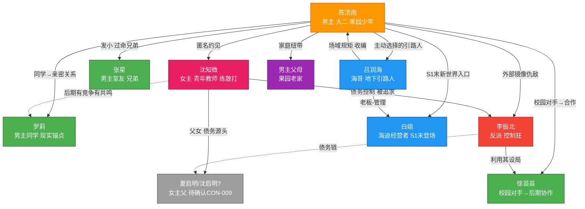
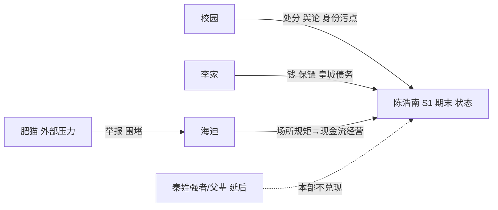

# 核心人物关系图（改版后）

> **完整图谱**：1024 节点 / 7838 边 / 0 孤点 / closed，由 `scripts/build_story_graph.py` 从 `wiki/` + S1 重构稿生成到 `graph/story-graph.json`。在本地浏览器通过 `packages/novel-flow-graph` 启动器查看。
>
> **本页**：从完整图谱中抽取 S1 核心人物子集，用 Mermaid 可读视图呈现，便于 review。

## S1 核心关系子图



## 核心关系说明表

| 关系 | 当前状态 | S1 期末预期 | 关键伏笔 |
|---|---|---|---|
| 陈浩南—沈知微 | Soul 匿名约见身份错位 | 互相欠命的秘密盟友，保持边界 | sou"烦"瞬间（clue-xia-debt）；声音耳熟（clue-xia-voice 已回收） |
| 陈浩南—张星 | 嘴贱室友 | 过命兄弟，但张星保留退出权 | 张星是最后"普通人锚点"，不能死 |
| 陈浩南—罗莉 | 有共同经历的普通同学 | 建立亲密关系后出现第一道裂缝 | 主角对罗莉的隐瞒与暴力 |
| 陈浩南—李振北 | 偶发情敌（第 3 章正式触发） | 人格摧毁为目标的镜像仇敌 | clue-mirror（主角逐渐采用相同逻辑） |
| 陈浩南—吕润海 | 第 12 章留置区偶遇 | 主角主动选择的引路人，非无条件后台 | clue-hai-motive（海哥为何扶持） |
| 陈浩南—徐苗苗 | 第 14 章校园对手 | 制造证据筹码阶段 | clue-xu-notebook |
| 陈浩南—白姐 | 第 30 章登场 | 让主角看到权力依赖经营 | 第 30 章章末钩子 |
| 沈知微—父亲 | 父女 | 债务线核心触发 | **CON-009 父亲姓氏待定** |
| 沈知微—李振北 | 债务逼婚控制 | 主动调查其资产网络 | clue-zhao-debt-chain |

## 后台与势力曲线（第 1 部末兑现）



## 相比原稿的关系线差异（本次重构）

| 差异点 | 原稿 | V2 |
|---|---|---|
| 女主独立性 | 被救援的对象 | 主动调查债务、能拒绝救援式占有 |
| 罗莉—主角关系 | 多次原谅 | 至少一次真实离开 |
| 徐苗苗情报 | 近万能 | 条件忠诚（主角承认她的能力） |
| 海哥扶持动机 | 看一眼认天命 | 场所规矩 + 肥猫冲突 + 留置观察三者叠加 |
| 终局后台 | 秦姓强者一键清场 | 第 1 部只兑现吕润海；父辈身世延后 |

## 在 FlowGram 查看完整图谱

```bash
cd /Users/bytedance/WorkBuddy\ AI/2026-10-08-17-33-38
npm --prefix packages/novel-flow-graph run dev
# 浏览器打开本地启动地址，加载 novels/qing-xian-meinv-laoshi/graph/story-graph.json
```

完整图谱覆盖：242 个 Wiki 页节点 + 747 章节点 + 22 条 S1 重写章节 + 全部双链关系，闭环无孤点。
