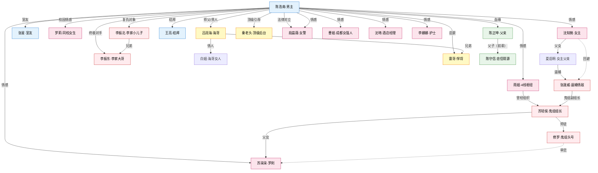
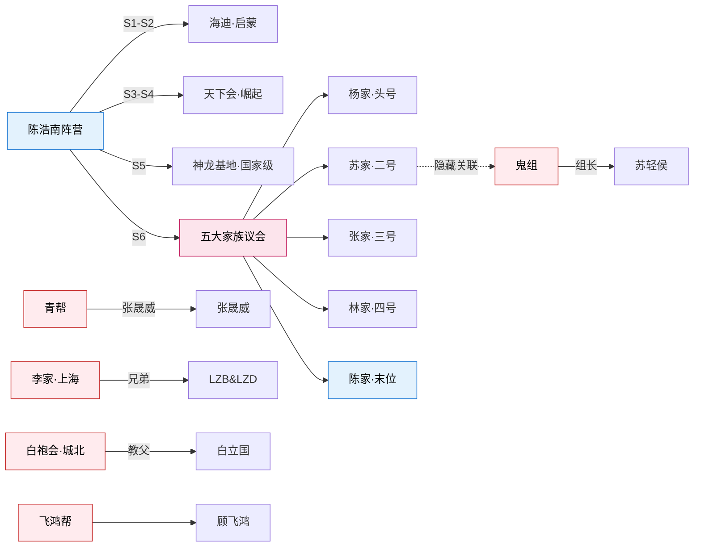

# 全书人物花名册与关系图谱（Review 用）

> 本报告用于用户 review 全书人物名单，决定哪些要改名/合并/删除/补齐。
> 全部人物页位于 `wiki/characters/`，共 97 人（不含 2 页 deprecated 迁移页）。
> 分组按**阵营/功能线**，不按出场顺序。

---

## 一、主角 + 核心关系圈（S1 核心，Review 重点）

| ID | 当前名 | 定位 | status | 建议 |
|---|---|---|---|---|
| char-chen-haonan | **陈浩南** | 主角，从网吧少年到帝都南哥 | confirmed | **已定名**（dec-007） |
| char-shen-zhiwei | **沈知微** | 女主，青年女教师 | confirmed | **用户 review 中**（本次要改名） |
| char-xia-qiming | **夏启明** | 女主父亲，上海商人（原著无家族，独立个人姓） | confirmed | 已定（dec-007） |
| char-zhang-xing | **张星** | 男主室友，普通人视角锚点 | proposed | 保留 |
| char-li-zhenbei | **李振北** | 男主第一个大敌，李家小儿子，追沈知微未遂 | confirmed | 保留 |
| char-li-zhendong | **李振东** | 李振北大哥，上海天悦集团总经理，隐藏终极反派 | proposed | 保留 |

---

## 二、女性关系网（后宫+事件女配，17 位）

| ID | 当前名 | 定位 | status | 和主角关系 |
|---|---|---|---|---|
| char-shen-zhiwei | 沈知微 | 女主，教师 | confirmed | **S1 核心情感线** |
| char-luo-li | 罗莉 | 计算机系大二，独立女性，男主"本该拥有"的普通生活 | confirmed | S1 校园情感线 |
| char-xu-miaomiao | 徐苗苗 | 学生会骨干+混子女生，被男主"商业布局" | proposed | S1-S2 第一次布局操练 |
| char-shen-qing | 沈晴 | 酒店大堂经理+娜娜合租姐姐，成熟风韵 | inferred | 上海阶段情感线 |
| char-li-nana | 李娜娜 | 护士，照护和生活感 | inferred | 中期情感线 |
| char-cao-jie | 曹姐 | 绿云超市创始人，成都女强人+寡妇 | inferred | 中期熟女线 |
| char-yu-jie | 雨姐 | 鬼组前杀手"叉"，开诊所的美女医生 | inferred | 中后期（4条线枢纽） |
| char-su-qiqi | 苏柒柒 | 鬼组罗刹，三大杀手之一 | inferred | 中后期（为男主叛组织） |
| char-ling-zhi | 凌芝 | 中后期高频关系人物 | inferred | 中后期情感线 |
| char-liu-yuanyuan | 刘园园 | 崔家巷困难家庭高三少女 | inferred | 中期救助线 |
| char-xiaoman | 小曼 | 上海逃亡阶段救助者 | inferred | 中期救助线 |
| char-jiang-yuwei | 蒋雨薇 | 神龙部队战友 | inferred | 后期军旅线 |
| char-lin-qingxue | 林清雪 | 林家小姐，赵半闲感情线 | inferred | 后期家族线 |
| char-luo-meng | 洛梦 | 明星"洛神"，背后有家族 | inferred | 中后期明星线 |
| char-jiang-lin | 江琳 | 中后期关系人物 | inferred | 中后期 |
| char-wang-xi | 王曦 | 中后期关系人物 | inferred | 中后期 |
| char-yang-lulu | 杨璐璐 | 罗莉好姐妹，平民系花 | inferred | S1 校园配角 |
| char-zhou-ying | 周颖 | 后期危险关系，飙车失控 | inferred | 后期 |
| char-zhao-liner | 赵琳儿 | 后期关系人物 | inferred | 后期 |
| char-duan-chenwei | 段晨薇 | 女警，法律 vs 地下秩序冲突 | inferred | 全书，终章怀孕伏笔 |

---

## 三、男主阵营（兄弟/下属/军师，16 位）

| ID | 当前名 | 定位 | 阶段 |
|---|---|---|---|
| char-lv-runhai | 吕润海（海哥） | 海迪老板，男主"引路人" | S1-S2 核心贵人 |
| char-bai-jie | 白姐 | 海迪总经理，海哥的女人 | S1-S2 |
| char-lei-ge | 雷哥 | 海迪悍将，给男主第一把蝴蝶刀 | S1-S2 启蒙 |
| char-wang-liang | 王亮 | 男主在海迪的第一个结拜兄弟 | S1-S2 |
| char-sun-yidao | 孙一刀 | 海迪及狼舞阶段 | S1-S3 |
| char-wugui-zhao | 乌龟罩 | 海迪分析型 | S1-S2 |
| char-zhang-xing | 张星 | 室友，普通人锚点 | 全书 |
| char-qian-kai | 钱凯 | 猎豹退伍精英，后期入伙 | S3+ |
| char-zhao-banxian | 赵半闲 | 忠信帮弃儿，男主后期核心军师 | S4-S6 |
| char-wang-liang | 王亮 | 结拜兄弟 | S1-S2 |
| char-da-niu | 大牛 | 天下会战力 | S4+ |
| char-zhu-anke | 朱安珂 | 天下会执行骨干 | S4+ |
| char-yu-yang | 于洋 | 阵营成员，参与行动救援 | 中后期 |
| char-wang-chen | 王晨 | 百乐赌场二把手，男主收编 | S3+ |
| char-badun | 巴顿 | 跨境阶段 | S5+ |
| char-shamu | 沙姆 | 海外与神龙阶段 | S5+ |
| char-mofeisi | 墨菲斯 | 海外阶段 | S5+ |

---

## 四、五大家族相关（家族恩怨主线，8 位）

| ID | 当前名 | 家族 | 定位 |
|---|---|---|---|
| char-chen-zhengkun | 陈正坤 | **陈家**（男主父亲） | 淮军系后裔，被驱逐支系 |
| char-chen-shouxin | 陈守信 | 陈家 | 上一代关键人物，忠信帮源头 |
| char-chen-mufan | 陈慕凡 | 陈家 | 后期人物 |
| char-su-qinghou | 苏轻侯 | **苏家** | 鬼组组长（苏柒柒父亲） |
| char-su-yue | 苏越 | 苏家 | 后辈，洛梦追求者 |
| char-yang-yi | 杨一 | **杨家** | 高手，神龙部队 |
| char-yang-zhikai | 杨志锴 | 杨家 | 神龙学院少爷 |
| char-lin-laoyezi | 林老爷子 | **林家** | 旧秩序代表 |
| char-lin-qingchao | 林青朝 | 林家 | 青花会会长 |
| char-lin-qingxue | 林清雪 | 林家 | 林老爷子孙女 |
| char-lin-zhiheng | 林志衡 | 林家 | 鬼组成员 |
| ❓**张家**无 | 张家 | **张家** | ⚠️ 原著"张少/张晟威"是情敌但不含张家族长 |

---

## 五、反派（地下势力对手+五大家族派生，20 位）

### 5.1 S1-S2 校园+海迪阶段反派
| ID | 当前名 | 定位 |
|---|---|---|
| char-li-zhenbei | 李振北 | 李家小儿子，追沈知微 |
| char-li-zhendong | 李振东 | 李振北大哥，隐藏终极反派 |
| char-fei-mao | 肥猫 | 海迪早期主要对手 |
| char-zhao-zihan | 赵子涵 | 校园阶层冲突 |
| char-zhou-jianren | 周贱人 | 校园阶段 |
| char-xiao-zhifei | 萧志飞 | 早期校园情感冲突 |
| char-fu-yanlin | 付燕林 | 校园及地方冲突 |
| char-liu-haisheng | 刘海生 | 罗莉前任，校园感情冲突 |

### 5.2 S3-S4 地方扩张阶段
| ID | 当前名 | 定位 |
|---|---|---|
| char-gu-feihong | 顾飞鸿 | 飞鸿帮领袖 |
| char-wang-longbin | 王龙斌 | 飞鸿帮行动 |
| char-geng-dazhong | 耿大忠 | 地方势力 |
| char-han-chun | 韩春 | 地方组织 |
| char-li-dong | 李东 | 地方组织 |
| char-liu-jiang | 刘江 | 中后期势力冲突 |
| char-sun-peng | 孙鹏 | 地方势力 |
| char-wen-tianqiang | 闻天强 | 地方势力 |
| char-xie-ting | 谢廷 | 地方扩张重要对手 |
| char-xu-le | 许乐 | 中后期事件 |
| char-jiang-donghua | 蒋东华 | 东华帮 |

### 5.3 S4-S5 跨城+家族阶段
| ID | 当前名 | 定位 |
|---|---|---|
| char-zhang-shengwei | 张晟威 | 恒丰少董+青帮堂主+鬼组副组长（原著女主逼婚对象） |
| char-xiuluo | 修罗 | 鬼组三大杀手之首 |
| char-yecha | 夜叉 | 鬼组成员 |
| char-bai-liguo | 白立国 | 白袍会领袖，城北教父 |
| char-lie-hu | 烈虎 | 高阶战力 |
| char-leng-qingfeng | 冷清风 | 神龙阶段 |
| char-song-hubing | 宋胡冰 | 南天集团+七杀 |

---

## 六、神龙部队/后台/顶级（S5-S6，7 位）

| ID | 当前名 | 定位 |
|---|---|---|
| char-qin-laotou | 秦老头 | 顶级后台，带男主入神龙 |
| char-xiao-yuanzhang | 肖院长 | 神龙学院管理者 |
| char-hacha-jiangjun | 哈察将军 | 跨境武装领袖 |
| char-yang-zhikai | 杨志锴 | 神龙少爷 |
| char-jiang-yuwei | 蒋雨薇 | 神龙战友 |
| char-leng-qingfeng | 冷清风 | 神龙阶段 |
| char-yang-yi | 杨一 | 杨家高手 |

---

## 七、低辨识度/边缘/建议合并（15 位）

> 这些人物在 Wiki 里只有基本信息，重构时可考虑合并/升级/删除。

| ID | 当前名 | 问题 | 建议 |
|---|---|---|---|
| char-a-guang | 阿光 | 徐苗苗事件配角 | 保留或合并到徐苗苗线 |
| char-chen-director-nephew | 陈校董侄子 | proposed，无实名 | 需要定名或删除 |
| char-wang-counselor | 王辅导员 | proposed，无剧情 | 可删 |
| char-huang-mao | 黄毛 | proposed | 可合并 |
| char-liu-qishan | 刘起山 | proposed | 需要定位 |
| char-zhou-mingyuan | 周明远 | proposed | 需要定位 |
| char-zhao-laoban | 赵老板 | proposed | 需要定位 |
| char-dong-xiao | 董潇 | 中后期配角 | 保留 |
| char-fang-xun | 方寻 | 中后期配角 | 保留 |
| char-feng-jianheng | 冯建恒 | 海迪阶段 | 保留 |
| char-hu-kebing | 胡科兵 | 天下会 | 保留 |
| char-luo-chen | 罗臣 | 罗莉家族 | 保留 |
| char-miao-wenlong | 苗文龙 | 中后期 | 保留 |
| char-wang-shaochuan | 王绍川 | 后期 | 保留 |
| char-xu-mingkang | 许明康 | 后期 | 保留 |
| char-zhang-jianguo | 张建国 | proposed | 需定位（原稿背景角色） |
| char-zhao-wei | 赵伟 | 分局关系 | 保留 |

---

## 八、关系图谱（Mermaid - 核心关系网）

---

## 九、全书势力关系（Mermaid - 阵营）

---

## 十、Review Checklist（给用户的问题清单）

### 优先 Review（S1 S2 核心人物）

- [ ] **沈知微**（女主）：改成什么名？保留"沈梓妍"？"沈梓宁"？或其他？
- [ ] **夏启明**（女主父亲）：姓名保留吗？按 dec-007 已定；原著是上海商人，重构后设定为"民间游侠学者"是否 OK？
- [ ] **张星**（室友）：名字 OK？
- [ ] **罗莉**（校园女生）：名字 OK？
- [ ] **李振北/李振东**（兄弟反派）：名字 OK？
- [ ] **吕润海（海哥）**：名字 OK？

### 次优 Review（S3-S6 核心人物）

- [ ] **陈正坤**（父亲）：名字 OK？他的身份现设定为"陈家淮军系被驱逐支系"是否 OK？
- [ ] **张晟威**（逼婚情敌+鬼组副组长）：名字 OK？他和五大家族张家是否要有血缘关联？
- [ ] **苏轻侯**（鬼组组长+苏家）：名字 OK？他和五大家族苏家的血缘关联？
- [ ] **秦老头**（顶级后台）：名字 OK？需要正名吗？
- [ ] **段晨薇**（女警）：名字 OK？

### 第三优 Review（后宫群女配）

- [ ] 女配群（沈晴、李娜娜、曹姐、雨姐、苏柒柒、凌芝、刘园园、小曼、蒋雨薇、林清雪、洛梦、江琳、王曦、杨璐璐、周颖、赵琳儿）：是否全部保留？保留 5-7 位后宫核心？其他降级为普通女配？

### 第四优 Review（反派群/配角群）

- [ ] 保留"修罗/夜叉"等鬼组反派的"动物/鬼神"类绰号？还是正名？
- [ ] 低辨识度配角（阿光/黄毛/陈校董侄子/王辅导员）是否删除？

### 第五优 Review（命名风格统一）

- [ ] 全书人物名命名风格：
  - 原著风格偏"随机起名"（张晟威、顾飞鸿、吕润海无统一感）
  - 是否要全书统一命名风格？建议保留原著名字避免过度洗稿
  - 侵权风险管理：姓氏可换 + 实质重构正文 + 独创桥段

---

## 十一、建议下一步

1. **先定女主名**（用户 review 中）
2. 定女主名后，决定是否同步调整其他 S1-S2 核心人物
3. 其余 90 位人物建议**保留原著名字**，重点通过"全书实质性重写+独创桥段+替换文化嵌入"规避侵权
4. 一次性批量 Wiki 迁移脚本待跑
