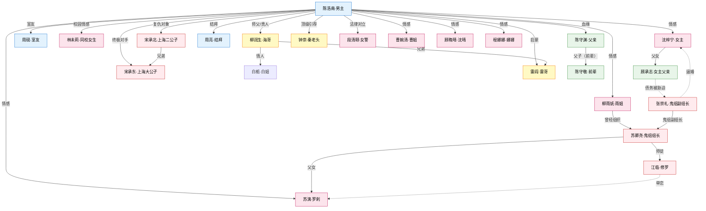
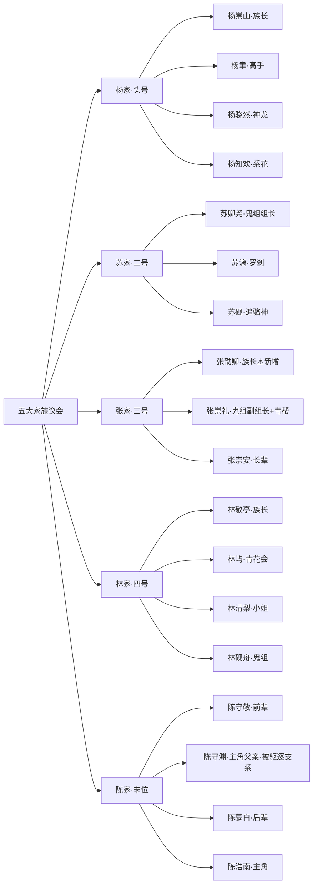

# 全书人物换名方案 V3（和老版彻底区分）

## 方案目标

1. **全书 94 位 active 人物全部换名**（不含 3 位 deprecated + 1 位 chen-haonan 已改）
2. 命名风格**整体统一**，不再是原著散装起名的拼贴感
3. **人物关系链保留**：父子/兄弟/师徒/情感/敌对关系完全不变
4. **五大家族姓氏锁定**：杨苏张林陈（dec-009 V3 已定）
5. 规避侵权：和原著除"主角阵营骨干功能"外，几乎所有具体名字都换

## 命名风格基调

- **男性**：**单字名或双字名**，用"承/辰/砚/临/川/舟/北/渊/远/卿"等硬朗带古意字
- **女性**：**双字名**，用"梓/宁/禾/鹿/鸢/昀/桐/棠/芷/清/言"等清透字
- **五大家族**：姓氏锁定，名字加"**崇/敬/卿**"等辈分感字
- **帮派绰号**：**保留绰号**（修罗/夜叉/罗刹/烈虎/雷哥/海哥）+ 补正名
- **方言称呼**（姐/哥/爷子）：**保留**，正名可查

## 姓氏池（避免撞车）

| 已占用 | 五大家族 | 可用 |
|---|---|---|
| 陈 杨 苏 张 林 | 五大家族 | - |
| 沈 顾 | 主角父母两族 | - |
| 宋 | 沪上望族（原李家兄弟） | - |
| 新增 | - | 周 钟 郑 谢 傅 江 柳 方 裴 黎 程 骆 宁 米 卓 戚 文 牟 龚 柯 贺 孟 乔 俞 谭 沙 穆 冯 卫 卜 柴 宇文 闵 邓 萧 金 许 聂 严 车 |

---

## 一、主角 + 核心关系圈（6 位）

| ID | 原名 | 新名 | 关系 | 命名说明 |
|---|---|---|---|---|
| chen-haonan | **陈浩南**（原陈照南）| **保留** | 主角 | 已改名，不动 |
| shen-zhiwei | 沈知微 | **沈梓宁** | 女主 | 保留原著"梓"字书卷气 + "宁"字清纯感 |
| xia-qiming | 夏启明 | **顾承志** | 女主父亲 | 独立姓氏（原著无家族）→ 改"顾"（书卷气），"承志"扣"民间游侠学者"人设 |
| zhang-xing | 张星 | **周砚** | 男主室友 | "砚"字朴实带文气，和男主"浩南"的烟火气呼应 |
| li-zhenbei | 李振北 | **宋承北** | 第一反派 | 李家 → **宋家**（沪上望族），"承北"保留原名"北"字记忆点 |
| li-zhendong | 李振东 | **宋承东** | 李振北大哥 | 和弟弟"承北"同辈字"承" |

> 关系链不变：宋承北是宋承东亲弟，追沈梓宁未遂 → 和陈浩南结仇。顾承志是沈梓宁父亲，被张家债务链逼婚。

---

## 二、五大家族（13 位）

### 2.1 杨家（头号家族，内务府皇商/御医系）

| ID | 原名 | 新名 | 定位 |
|---|---|---|---|
| yang-hongguo | 杨宏国 | **杨崇山** | 杨家族长 |
| yang-yi | 杨一 | **杨聿** | 杨家高手 |
| yang-zhikai | 杨志锴 | **杨骁然** | 神龙学院少爷 |
| yang-lulu | 杨璐璐 | **杨知欢** | 平民系花（杨家旁支/本家） |

### 2.2 苏家（二号，江南漕运/血脉）

| ID | 原名 | 新名 | 定位 |
|---|---|---|---|
| su-qinghou | 苏轻侯 | **苏卿尧** | 鬼组组长，苏家 |
| su-qiqi | 苏柒柒 | **苏漓** | 鬼组罗刹，苏卿尧女儿 |
| su-yue | 苏越 | **苏砚** | 苏家后辈，追骆神 |

### 2.3 张家（三号，北洋奉系+军统）

| ID | 原名 | 新名 | 定位 |
|---|---|---|---|
| zhang-shengwei | 张晟威 | **张崇礼** | 张家少爷+青帮堂主+鬼组副组长 |
| zhang-jianguo | 张建国 | **张崇安** | 张家长辈 |
| **新增** | - | **张劭卿** | ⚠️ 建议补张家族长（原著缺位） |

### 2.4 林家（四号，湘军系医药）

| ID | 原名 | 新名 | 定位 |
|---|---|---|---|
| lin-laoyezi | 林老爷子 | **林敬亭**（林老爷子）| 林家族长 |
| lin-qingchao | 林青朝 | **林屿** | 青花会会长，林敬亭孙子 |
| lin-qingxue | 林清雪 | **林清梨** | 林敬亭孙女，林屿妹妹 |
| lin-zhiheng | 林志衡 | **林砚舟** | 林家旁支，鬼组成员 |

### 2.5 陈家（五号，主角本家，淮军系）

| ID | 原名 | 新名 | 定位 |
|---|---|---|---|
| chen-zhengkun | 陈正坤 | **陈守渊** | 主角父亲，被驱逐支系 |
| chen-shouxin | 陈守信 | **陈守敬** | 陈家前辈，忠信帮源头 |
| chen-mufan | 陈慕凡 | **陈慕白** | 陈家后辈 |

> 关系链不变：张崇礼追沈梓宁+青帮+鬼组副组长；苏漓是苏卿尧女儿；陈守渊是陈浩南父亲+被陈守敬一辈驱逐；林敬亭祖孙三代（林敬亭→林屿/林清梨/林砚舟）。

---

## 三、男主阵营（17 位）

### 3.1 海迪系（S1-S2）

| ID | 原名 | 新名 | 定位 |
|---|---|---|---|
| lv-runhai | 吕润海（海哥）| **柳润生**（海哥） | 海迪老板，男主引路人 |
| bai-jie | 白姐 | **白栀**（白姐） | 海迪总经理，海哥女人 |
| lei-ge | 雷哥 | **雷阎**（雷哥） | 海迪悍将，给男主蝴蝶刀 |
| wang-liang | 王亮 | **周亮** | 男主在海迪的第一个结拜兄弟 |
| sun-yidao | 孙一刀 | **孙远樵**（孙一刀） | 海迪及狼舞成员 |
| wugui-zhao | 乌龟罩 | **赵识远**（乌龟罩） | 海迪分析型 |

### 3.2 后期阵营（S3-S6）

| ID | 原名 | 新名 | 定位 |
|---|---|---|---|
| qian-kai | 钱凯 | **钱砚** | 猎豹退伍精英 |
| zhao-banxian | 赵半闲 | **郑半闲** | 核心军师 |
| wang-chen | 王晨 | **顾辰** | 百乐赌场二把手，男主收编 |
| da-niu | 大牛 | **牛砚**（大牛） | 天下会战力 |
| zhu-anke | 朱安珂 | **朱安砚** | 天下会执行骨干 |
| yu-yang | 于洋 | **俞川** | 行动与救援 |
| badun | 巴顿 | **谭斌**（巴顿） | 跨境阶段 |
| shamu | 沙姆 | **沙慕远**（沙姆） | 海外与神龙 |
| mofeisi | 墨菲斯 | **穆砚川**（墨菲斯） | 海外阶段 |

> 关系链不变：柳润生（海哥）- 白栀（海哥女人）- 雷阎 - 周亮；郑半闲是男主核心军师；顾辰收编自百乐。

---

## 四、女性关系网（19 位）

### 4.1 S1 校园圈

| ID | 原名 | 新名 | 定位 |
|---|---|---|---|
| luo-li | 罗莉 | **林未莉** | 计算机系女生，男主"本该拥有" |
| xu-miaomiao | 徐苗苗 | **徐绵绵** | 学生会骨干，男主第一次布局 |
| yang-lulu | 杨璐璐 | 已改**杨知欢** | 林未莉好姐妹 |

### 4.2 S2-S3 跨城熟女圈

| ID | 原名 | 新名 | 定位 |
|---|---|---|---|
| shen-qing | 沈晴 | **顾晚晴** | 酒店大堂经理（与沈家冲突故改顾） |
| li-nana | 李娜娜 | **程娜娜** | 护士（与宋家冲突故改程） |
| cao-jie | 曹姐 | **曹婉清**（曹姐） | 成都女强人+寡妇 |
| yu-jie | 雨姐 | **柳雨妩**（雨姐） | 鬼组前"叉"，开诊所 |
| xiaoman | 小曼 | **乔小曼** | 上海逃亡救助 |
| liu-yuanyuan | 刘园园 | **柳元禾** | 崔家巷困难少女 |

### 4.3 S4-S5 高层圈

| ID | 原名 | 新名 | 定位 |
|---|---|---|---|
| su-qiqi | 苏柒柒 | 已改**苏漓** | 鬼组罗刹 |
| ling-zhi | 凌芝 | **凌初** | 中后期高频 |
| jiang-yuwei | 蒋雨薇 | **江雨薇** | 神龙战友 |
| lin-qingxue | 林清雪 | 已改**林清梨** | 林家小姐 |
| luo-meng | 洛梦 | **骆梦**（艺名"洛神"）| 明星+家族 |
| jiang-lin | 江琳 | **方婼琳** | 中后期关系 |
| wang-xi | 王曦 | **顾曦** | 中后期关系 |
| zhou-ying | 周颖 | **邓婼** | 后期飙车失控 |
| zhao-liner | 赵琳儿 | **孟琳儿** | 后期关系 |
| duan-chenwei | 段晨薇 | **段清颐** | 女警 |

> 关系链不变：19 位女性各自情感线独立，不互为血缘；苏漓是苏卿尧女儿；林清梨是林屿妹妹。

---

## 五、反派群（22 位）

### 5.1 S1-S2 校园+海迪

| ID | 原名 | 新名 | 定位 |
|---|---|---|---|
| fei-mao | 肥猫 | **郝胖**（肥猫） | 海迪早期对手 |
| zhao-zihan | 赵子涵 | **邓子涵** | 校园阶层冲突 |
| zhou-jianren | 周贱人 | **周狗蛋**（周贱） | 校园阶段 |
| xiao-zhifei | 萧志飞 | **萧远志** | 校园情感冲突 |
| fu-yanlin | 付燕林 | **傅延林** | 校园及地方 |
| liu-haisheng | 刘海生 | **柯海生** | 罗莉前任 |

### 5.2 S3-S4 地方扩张

| ID | 原名 | 新名 | 定位 |
|---|---|---|---|
| gu-feihong | 顾飞鸿 | **贺飞鸿** | 飞鸿帮领袖（与顾家冲突故改贺） |
| wang-longbin | 王龙斌 | **牟龙斌** | 飞鸿帮行动 |
| geng-dazhong | 耿大忠 | **龚大忠** | 地方势力 |
| han-chun | 韩春 | **米春** | 地方组织 |
| li-dong | 李东 | **柯东** | 地方组织（与宋家冲突故改柯） |
| liu-jiang | 刘江 | **柳江** | 中后期冲突 |
| sun-peng | 孙鹏 | **戚鹏** | 地方势力 |
| wen-tianqiang | 闻天强 | **文天霁** | 地方势力 |
| xie-ting | 谢廷 | **谢庭** | 地方扩张重要对手 |
| xu-le | 许乐 | **贺乐** | 中后期事件 |
| jiang-donghua | 蒋东华 | **江东华** | 东华帮 |

### 5.3 S4-S5 跨城家族

| ID | 原名 | 新名 | 定位 |
|---|---|---|---|
| xiuluo | 修罗 | **江临**（修罗） | 鬼组三大杀手之首 |
| yecha | 夜叉 | **闵北辰**（夜叉） | 鬼组成员 |
| bai-liguo | 白立国 | **卜立国** | 白袍会领袖，城北教父 |
| lie-hu | 烈虎 | **柴烈**（烈虎） | 高阶战力 |
| leng-qingfeng | 冷清风 | **冷清砚** | 神龙阶段 |
| song-hubing | 宋胡冰 | **宇文冰** | 南天集团（与宋家冲突故改宇文） |
| zhang-shengwei | 张晟威 | 已改**张崇礼** | 张家少爷+青帮+鬼组副组长 |

> 关系链不变：江临/闵北辰/苏漓是鬼组三大杀手；苏卿尧是组长；张崇礼是副组长；江临单恋苏漓。

---

## 六、神龙+顶级后台（5 位）

| ID | 原名 | 新名 | 定位 |
|---|---|---|---|
| qin-laotou | 秦老头 | **钟崇**（秦老头/钟老头） | 顶级后台 |
| xiao-yuanzhang | 肖院长 | **肖承章**（肖院长） | 神龙学院管理者 |
| hacha-jiangjun | 哈察将军 | **保留"哈察"** | 跨境武装（少数民族色彩，不动） |
| yang-zhikai | 杨志锴 | 已改**杨骁然** | 神龙少爷 |
| jiang-yuwei | 蒋雨薇 | 已改**江雨薇** | 神龙战友 |

---

## 七、边缘/配角（15 位）

### 7.1 建议删除（无剧情定位）

| ID | 原名 | 处理 | 理由 |
|---|---|---|---|
| chen-director-nephew | 陈校董侄子 | **删除** | proposed 状态，无实名无定位 |
| wang-counselor | 王辅导员 | **删除** | proposed，无剧情 |

### 7.2 保留但改名

| ID | 原名 | 新名 | 定位 |
|---|---|---|---|
| a-guang | 阿光 | **余光**（阿光） | 徐绵绵相关 |
| huang-mao | 黄毛 | **苟海**（黄毛） | 校园配角 |
| liu-qishan | 刘起山 | **柳起山** | 需定位 |
| zhou-mingyuan | 周明远 | **严远知** | 需定位（避免和周砚周亮撞） |
| zhao-laoban | 赵老板 | **孟老板** | 需定位 |
| dong-xiao | 董潇 | **卓潇** | 中后期配角 |
| fang-xun | 方寻 | **方寻** 保留 | 中后期配角 |
| feng-jianheng | 冯建恒 | **冯承恒** | 海迪阶段 |
| hu-kebing | 胡科兵 | **贺科兵** | 天下会 |
| luo-chen | 罗臣 | **宁臣** | 罗莉已改林未莉，罗臣同步换 |
| miao-wenlong | 苗文龙 | **苗文龙** 保留 | 中后期 |
| wang-shaochuan | 王绍川 | **卫绍川** | 后期 |
| xu-mingkang | 许明康 | **贺明康** | 后期 |
| zhao-wei | 赵伟 | **赵伟** 保留 | 分局关系 |

---

## 八、已废弃迁移页（保留 deprecated 不动）

| ID | 状态 | 说明 |
|---|---|---|
| chen-zhaonan | deprecated | 迁移至 chen-haonan，保留做历史追溯 |
| xia-ziyan | deprecated | 迁移至 shen-zhiwei → shen-zining，保留 |
| xia-jianguo | deprecated | 迁移至 xia-qiming → gu-chengzhi，保留 |

---

## 九、人物关系图（Mermaid - 新名完整版）

---

## 十、五大家族关系图（新名）

---

## 十一、迁移执行清单

### 若用户批准 V3 方案，需要执行：

1. **批量重命名 Wiki 文件**：
   - `char-shen-zhiwei.md` → `char-shen-zining.md`
   - `char-xia-qiming.md` → `char-gu-chengzhi.md`
   - ... 共约 90 个文件重命名

2. **批量更新双链**：
   - 全书 Wiki 页面中约 300+ 处 `[[characters/char-xxx|中文名]]` 需同步

3. **更新 S1 c001 正文**：
   - 沈知微 → 沈梓宁（全文替换）

4. **更新 novel.yaml 简介**：
   - 陈浩南保留；无其他人名出现

5. **更新所有决策文件**：
   - dec-007（父亲姓氏保留 → 现改顾承志）
   - dec-012（简介）

6. **图谱重建**：
   - `scripts/build_story_graph.py`
   - `scripts/build_framework_graphs.py`

7. **lint 验证**：
   - 0 断链 / 0 孤点

---

## 十二、Review Checklist（给用户选）

### 核心人物（必 review）

- [ ] **沈梓宁**（女主，原沈知微/夏梓妍）→ OK？
- [ ] **顾承志**（女主父亲，原夏启明）→ OK？或者坚持保留夏启明？
- [ ] **周砚**（室友，原张星）→ OK？
- [ ] **宋承北/宋承东**（兄弟反派，原李振北/李振东）→ OK？或者保留"李"姓？

### 五大家族（必 review）

- [ ] 杨家 杨崇山/杨聿/杨骁然/杨知欢 → OK？
- [ ] 苏家 苏卿尧/苏漓/苏砚 → OK？
- [ ] 张家 张崇礼/张崇安/**新增 张劭卿族长** → OK？
- [ ] 林家 林敬亭/林屿/林清梨/林砚舟 → OK？
- [ ] 陈家 陈守渊（父）/陈守敬（前辈）/陈慕白 → OK？

### 男主阵营（建议 review）

- [ ] 柳润生（海哥，原吕润海）→ OK？
- [ ] 郑半闲（原赵半闲）→ OK？
- [ ] 顾辰（原王晨）→ OK？

### 女性关系网（建议 review）

- [ ] 林未莉（原罗莉）→ OK？
- [ ] 顾晚晴（原沈晴）→ OK？
- [ ] 苏漓（原苏柒柒）→ OK？
- [ ] 骆梦（原洛梦，艺名"洛神"保留）→ OK？
- [ ] 段清颐（原段晨薇）→ OK？

### 反派（选择性 review）

- [ ] 鬼组三大杀手 江临（修罗）/ 闵北辰（夜叉）/ 苏漓（罗刹）→ OK？
- [ ] 卜立国（原白立国，城北教父）→ OK？
- [ ] 骨干对手 贺飞鸿/文天霁/谢庭 → OK？

### 其他

- [ ] 要删除的两位（陈校董侄子/王辅导员）→ 确认删除？
- [ ] 命名风格整体 → OK？
- [ ] 需要大改哪些名字？
