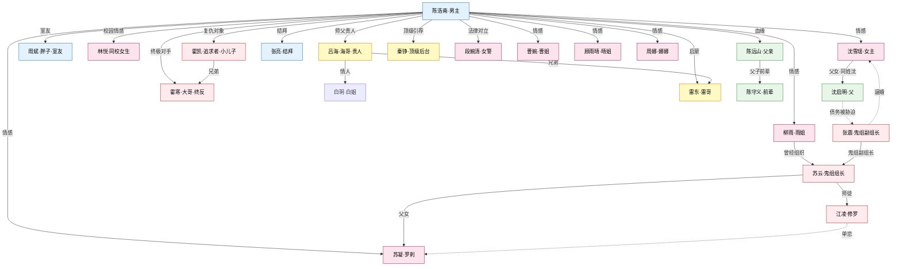
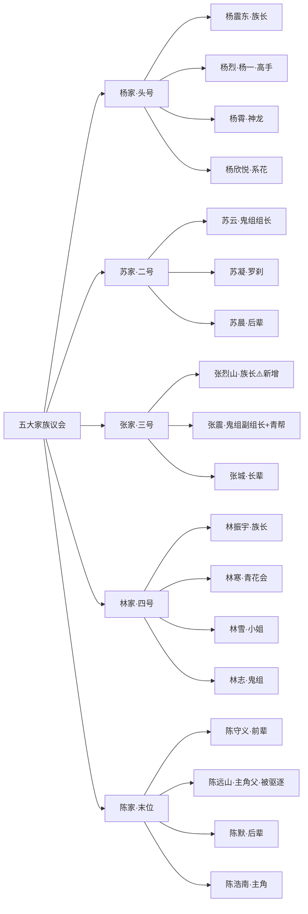

# 全书人物换名方案 V4（现代都市+玄幻+后宫风）

> **2026-10-09 用户已批准本方案**，正式批准记录见 `decisions/dec-20261009-013-v4-renaming-approval.md`。当日已完成 Wiki/重构章节的实体 ID、双链与正式中文名批量迁移；原稿与 `drafts/manuscript/latest.md` 保留旧名，随正式重写逐章替换。

## 本次调整要点（相对 V3）

| 问题 | V3 做法 | V4 修正 |
|---|---|---|
| 父女不同姓（dec-007 随母姓沈） | 女主沈/父亲顾 | **父女同姓**，统一归到女主家族姓 |
| 命名风格过古风 | 砚/聿/临/禾/鸢/昀/桐/棠/芷 | **现代都市感**，番茄男频同类书常用字 |
| 直接谐音改编 | 李振北→宋承北 | **彻底换姓换名**，不要同韵同字残留 |
| 没有外号/小名 | 只有正名 | **补齐外号/小名**（海哥/南哥/胖子/罗刹/夜叉/修罗保留） |
| 书名《从网吧少年到帝都南哥》 | - | 命名风格对齐**现代都市+玄幻+后宫**题材 |

## 命名风格基调

- **朗朗上口**：双字名为主，三字名偶尔用（如家族族长）
- **现代都市**：用"**东/强/烈/凯/寒/风/锋/明/涛/鹏/浩/杰/辉/斌**"等男性字；用"**雪/瑶/璃/悦/婉/颖/晴/琳/梦/凝**"等女性字
- **玄幻感**：鬼组/修罗/夜叉/罗刹外号 **保留**；神龙基地的高手名字可以带"**震/霆/烈/云/霄**"
- **后宫感**：女性角色名字清纯 + 可区分（避免同质化）
- **五大家族**：姓氏锁定 **杨苏张林陈**；辈分字用"**守/慕/朗/云**"等现代字，不用"崇/敬/卿"

## 姓氏池（避免撞车）

| 已锁定 | 占用 |
|---|---|
| **陈 杨 苏 张 林** | 五大家族 |
| **沈** | 女主本家（独立姓氏，非家族） |
| 新增选择池 | 周 吕 雷 霍 郑 郝 柳 骆 顾 江 徐 曹 乔 冯 胡 宁 卫 肖 秦 段 卜 穆 韩 文 贺 牟 龚 米 柯 谢 戚 牛 牟 王 刘 赵 吴 魏 侯 严 傅 邓 龚 卓 俞 谭 聂 车 |

---

## 一、主角 + 核心关系圈（6 位）

| ID | 原名 | **新名** | 小名/外号 | 关系 |
|---|---|---|---|---|
| chen-haonan | 陈照南 | **陈浩南** | 浩子/南哥 | 主角 |
| shen-zhiwei | 沈知微/夏梓妍 | **沈雪瑶** | 瑶瑶/雪儿 | 女主 |
| xia-qiming | 夏启明 | **沈启明** | 沈总/沈伯 | 女主父亲（**父女同姓沈**） |
| zhang-xing | 张星 | **周斌** | 胖子/阿斌 | 男主室友 |
| li-zhenbei | 李振北 | **霍凯** | 凯少 | 第一反派（上海霍家） |
| li-zhendong | 李振东 | **霍寒** | 寒哥 | 霍凯大哥，隐藏终极反派 |

> **关系链不变**：霍凯是霍寒亲弟，追沈雪瑶未遂 → 和陈浩南结仇；沈雪瑶是沈启明独生女，父女相依为命。
> **沈家不是五大家族，是独立姓氏**。沈启明在原稿是上海商人，重构后设定为"民间游侠学者"。

---

## 二、五大家族（15 位）

### 2.1 杨家（头号家族，内务府皇商/御医系）

| ID | 原名 | **新名** | 小名/外号 | 定位 |
|---|---|---|---|---|
| yang-hongguo | 杨宏国 | **杨震东** | 杨老爷子 | 杨家族长 |
| yang-yi | 杨一 | **杨烈** | 杨一（内部编号） | 杨家高手 |
| yang-zhikai | 杨志锴 | **杨霄** | 小霄 | 神龙学院少爷 |
| yang-lulu | 杨璐璐 | **杨欣悦** | 悦悦 | 平民系花 |

### 2.2 苏家（二号家族，江南漕运+血脉）

| ID | 原名 | **新名** | 小名/外号 | 定位 |
|---|---|---|---|---|
| su-qinghou | 苏轻侯 | **苏云** | 苏爷/云爷 | 苏家族长+鬼组组长 |
| su-qiqi | 苏柒柒 | **苏凝** | 罗刹（鬼组绰号） | 鬼组三大杀手之一 |
| su-yue | 苏越 | **苏晨** | - | 苏家后辈 |

### 2.3 张家（三号家族，北洋奉系+军统）

| ID | 原名 | **新名** | 小名/外号 | 定位 |
|---|---|---|---|---|
| **新增** | - | **张烈山** | 张老爷子 | ⚠️**新增张家族长**（原著缺位） |
| zhang-shengwei | 张晟威 | **张震** | 张少 | 张家少爷+青帮+鬼组副组长 |
| zhang-jianguo | 张建国 | **张城** | - | 张家长辈 |

### 2.4 林家（四号家族，湘军系+医药）

| ID | 原名 | **新名** | 小名/外号 | 定位 |
|---|---|---|---|---|
| lin-laoyezi | 林老爷子 | **林振宇** | 林老爷子 | 林家族长 |
| lin-qingchao | 林青朝 | **林寒** | - | 青花会会长 |
| lin-qingxue | 林清雪 | **林雪** | 雪儿 | 林家小姐（和女主小名区分，故女主改用"瑶瑶"主叫） |
| lin-zhiheng | 林志衡 | **林志** | - | 林家旁支，鬼组成员 |

### 2.5 陈家（五号家族，男主本家，淮军系）

| ID | 原名 | **新名** | 小名/外号 | 定位 |
|---|---|---|---|---|
| chen-shouxin | 陈守信 | **陈守义** | 陈老爷子 | 陈家前辈，忠信帮源头 |
| chen-zhengkun | 陈正坤 | **陈远山** | 老陈 | 男主父亲，被驱逐支系 |
| chen-mufan | 陈慕凡 | **陈默** | - | 陈家后辈 |

> **关系链不变**：
> - 张震是张烈山孙子，追沈雪瑶/青帮/鬼组副组长
> - 苏凝是苏云女儿，鬼组罗刹
> - 林振宇祖孙三代（林振宇→林寒/林雪/林志）
> - 陈远山（父）被陈守义（前辈）一辈驱逐出京畿陈家

---

## 三、男主阵营（17 位）

### 3.1 海迪系（S1-S2）

| ID | 原名 | **新名** | 小名/外号 | 定位 |
|---|---|---|---|---|
| lv-runhai | 吕润海 | **吕海** | 海哥 | 海迪老板，男主引路人 |
| bai-jie | 白姐 | **白玥** | 白姐 | 海迪总经理，海哥女人 |
| lei-ge | 雷哥 | **雷东** | 雷哥 | 海迪悍将，给男主蝴蝶刀 |
| wang-liang | 王亮 | **张亮** | 大亮/亮哥 | 男主结拜兄弟 |
| sun-yidao | 孙一刀 | **孙锋** | 孙一刀（绰号） | 海迪及狼舞成员 |
| wugui-zhao | 乌龟罩 | **赵涛** | 乌龟罩（绰号） | 海迪分析型 |

### 3.2 后期阵营（S3-S6）

| ID | 原名 | **新名** | 小名/外号 | 定位 |
|---|---|---|---|---|
| qian-kai | 钱凯 | **钱锋** | - | 猎豹退伍精英 |
| zhao-banxian | 赵半闲 | **郑半闲** | 半闲 | 核心军师 |
| wang-chen | 王晨 | **顾辰** | - | 百乐赌场二把手 |
| da-niu | 大牛 | **牛强** | 大牛 | 天下会战力 |
| zhu-anke | 朱安珂 | **朱安** | - | 天下会执行骨干 |
| yu-yang | 于洋 | **俞洋** | - | 行动与救援 |
| badun | 巴顿 | **谭斌** | 巴顿（绰号） | 跨境阶段 |
| shamu | 沙姆 | **沙漠** | 沙姆（绰号） | 海外与神龙 |
| mofeisi | 墨菲斯 | **穆飞** | 墨菲斯（外号） | 海外阶段 |

> **关系链不变**：吕海（海哥）- 白玥（海哥女人）- 雷东 - 张亮；郑半闲是男主军师；顾辰收编自百乐。

---

## 四、女性关系网（19 位）

### 4.1 S1 校园圈

| ID | 原名 | **新名** | 小名/外号 | 定位 |
|---|---|---|---|---|
| luo-li | 罗莉 | **林悦** | 小悦 | 计算机系女生 |
| xu-miaomiao | 徐苗苗 | **徐甜** | 甜甜/苗苗 | 学生会骨干 |
| yang-lulu | 杨璐璐 | **杨欣悦** | 悦悦 | 林悦好姐妹 |

### 4.2 S2-S3 跨城熟女圈

| ID | 原名 | **新名** | 小名/外号 | 定位 |
|---|---|---|---|---|
| shen-qing | 沈晴 | **顾雨晴** | 晴姐 | 酒店大堂经理（独立姓避开沈家） |
| li-nana | 李娜娜 | **周娜** | 娜娜 | 护士 |
| cao-jie | 曹姐 | **曹婉** | 曹姐 | 成都女强人+寡妇 |
| yu-jie | 雨姐 | **柳雨** | 雨姐 | 鬼组前"叉"，诊所医生 |
| xiaoman | 小曼 | **乔曼** | 小曼 | 上海逃亡救助 |
| liu-yuanyuan | 刘园园 | **柳园** | 园园 | 崔家巷困难少女 |

### 4.3 S4-S5 高层圈

| ID | 原名 | **新名** | 小名/外号 | 定位 |
|---|---|---|---|---|
| su-qiqi | 苏柒柒 | 已改**苏凝** | 罗刹 | 鬼组罗刹 |
| ling-zhi | 凌芝 | **凌雪** | - | 中后期高频 |
| jiang-yuwei | 蒋雨薇 | **江小薇** | 小薇 | 神龙战友 |
| lin-qingxue | 林清雪 | 已改**林雪** | 雪儿 | 林家小姐 |
| luo-meng | 洛梦 | **骆璃** | 洛神（艺名） | 明星 |
| jiang-lin | 江琳 | **江琳** 保留 | 琳姐 | 中后期关系 |
| wang-xi | 王曦 | **王曦** 保留 | - | 中后期关系 |
| zhou-ying | 周颖 | **邓颖** | - | 后期飙车失控 |
| zhao-liner | 赵琳儿 | **赵琳** | 琳儿 | 后期关系 |
| duan-chenwei | 段晨薇 | **段婉清** | 婉清 | 女警 |

---

## 五、反派群（22 位）

### 5.1 S1-S2 校园+海迪

| ID | 原名 | **新名** | 小名/外号 | 定位 |
|---|---|---|---|---|
| fei-mao | 肥猫 | **胡胖** | 肥猫 | 海迪早期对手 |
| zhao-zihan | 赵子涵 | **邓子涵** | - | 校园阶层冲突 |
| zhou-jianren | 周贱人 | **周建人** | 周贱（外号） | 校园阶段 |
| xiao-zhifei | 萧志飞 | **萧志** | - | 校园情感冲突 |
| fu-yanlin | 付燕林 | **付延林** | - | 校园及地方 |
| liu-haisheng | 刘海生 | **刘海** | - | 林悦前任 |

### 5.2 S3-S4 地方扩张

| ID | 原名 | **新名** | 小名/外号 | 定位 |
|---|---|---|---|---|
| gu-feihong | 顾飞鸿 | **贺飞鸿** | - | 飞鸿帮领袖 |
| wang-longbin | 王龙斌 | **王龙** | - | 飞鸿帮行动 |
| geng-dazhong | 耿大忠 | **耿忠** | - | 地方势力 |
| han-chun | 韩春 | **韩春** 保留 | - | 地方组织 |
| li-dong | 李东 | **宋东** | - | 地方组织（李姓避开） |
| liu-jiang | 刘江 | **刘江** 保留 | - | 中后期冲突 |
| sun-peng | 孙鹏 | **孙鹏** 保留 | - | 地方势力 |
| wen-tianqiang | 闻天强 | **文天强** | - | 地方势力 |
| xie-ting | 谢廷 | **谢庭** | - | 地方扩张重要对手 |
| xu-le | 许乐 | **贺乐** | - | 中后期事件 |
| jiang-donghua | 蒋东华 | **江东华** | - | 东华帮 |

### 5.3 S4-S5 跨城家族

| ID | 原名 | **新名** | 小名/外号 | 定位 |
|---|---|---|---|---|
| xiuluo | 修罗 | **江凌** | 修罗（鬼组绰号） | 鬼组三大杀手之首 |
| yecha | 夜叉 | **孟北** | 夜叉（鬼组绰号） | 鬼组成员 |
| bai-liguo | 白立国 | **卜立国** | 老卜 | 白袍会领袖，城北教父 |
| lie-hu | 烈虎 | **韩烈** | 烈虎（绰号） | 高阶战力 |
| leng-qingfeng | 冷清风 | **冷风** | - | 神龙阶段 |
| song-hubing | 宋胡冰 | **穆冰** | - | 南天集团（避开宋/霍姓） |
| zhang-shengwei | 张晟威 | 已改**张震** | 张少 | 张家少爷+青帮+鬼组副组长 |

> **关系链不变**：江凌（修罗）、孟北（夜叉）、苏凝（罗刹）是鬼组三大杀手；苏云是组长；张震是副组长；江凌单恋苏凝。

---

## 六、神龙+顶级后台（5 位）

| ID | 原名 | **新名** | 小名/外号 | 定位 |
|---|---|---|---|---|
| qin-laotou | 秦老头 | **秦铮** | 秦老头 | 顶级后台 |
| xiao-yuanzhang | 肖院长 | **肖霆** | 肖院长 | 神龙学院管理者 |
| hacha-jiangjun | 哈察将军 | **哈察将军** 保留 | 哈察 | 跨境武装（少数民族色彩不动） |
| yang-zhikai | 杨志锴 | 已改**杨霄** | 小霄 | 神龙少爷 |
| jiang-yuwei | 蒋雨薇 | 已改**江小薇** | 小薇 | 神龙战友 |

---

## 七、边缘/配角（15 位）

### 7.1 建议删除（无剧情定位）

| ID | 原名 | 处理 | 理由 |
|---|---|---|---|
| chen-director-nephew | 陈校董侄子 | **删除** | proposed 无实名无定位 |
| wang-counselor | 王辅导员 | **删除** | proposed 无剧情 |

### 7.2 保留但改名

| ID | 原名 | **新名** | 小名/外号 |
|---|---|---|---|
| a-guang | 阿光 | **余光** | 阿光 |
| huang-mao | 黄毛 | **王海** | 黄毛 |
| liu-qishan | 刘起山 | **刘起山** 保留 | - |
| zhou-mingyuan | 周明远 | **严远** | - |
| zhao-laoban | 赵老板 | **孟老板** | - |
| dong-xiao | 董潇 | **卓潇** | - |
| fang-xun | 方寻 | **方寻** 保留 | - |
| feng-jianheng | 冯建恒 | **冯建** | - |
| hu-kebing | 胡科兵 | **胡科** | - |
| luo-chen | 罗臣 | **宁臣** | - |
| miao-wenlong | 苗文龙 | **苗文龙** 保留 | - |
| wang-shaochuan | 王绍川 | **卫绍川** | - |
| xu-mingkang | 许明康 | **许康** | - |
| zhao-wei | 赵伟 | **赵伟** 保留 | - |

---

## 八、关系图（新名，Mermaid）

---

## 九、五大家族关系（新名）

---

## 十、规模摘要

| 项目 | 数量 |
|---|---|
| 全书 active 人物 | 94 |
| 建议删除 | 2 |
| 保留原名 | 7（韩春/刘江/孙鹏/方寻/苗文龙/赵伟/王曦/江琳 + 哈察） |
| **换名** | **约 85 位** |
| 新增（张家族长） | 1 |

---

## 十一、Review Checklist

### 核心必答

- [ ] **沈雪瑶**（女主）→ OK？
- [ ] **沈启明**（父，父女同姓沈）→ OK？
- [ ] **周斌（胖子）**（室友）→ OK？
- [ ] **霍凯/霍寒**（原李振北/李振东）→ OK？

### 五大家族

- [ ] 杨震东（族长）/杨烈/杨霄/杨欣悦 → OK？
- [ ] 苏云（组长）/苏凝（罗刹）/苏晨 → OK？
- [ ] 张家 **张烈山新增**/张震/张城 → OK？
- [ ] 林振宇/林寒/林雪/林志 → OK？
- [ ] 陈远山（父）/陈守义（前辈）/陈默 → OK？

### 男主阵营

- [ ] 吕海（海哥）/白玥（白姐）/雷东（雷哥）/张亮/孙锋/赵涛 → OK？
- [ ] 郑半闲/顾辰/钱锋 → OK？

### 女性

- [ ] 林悦/徐甜（甜甜）/杨欣悦 → OK？
- [ ] 顾雨晴/周娜/曹婉/柳雨/乔曼/柳园 → OK？
- [ ] 苏凝/凌雪/江小薇/林雪/骆璃/段婉清 → OK？

### 鬼组绰号+正名

- [ ] 江凌（修罗）/孟北（夜叉）/苏凝（罗刹）→ OK？

### 其他

- [ ] 卜立国/韩烈（烈虎）/穆冰 → OK？
- [ ] 删除陈校董侄子/王辅导员 → 确认？

---

## 十二、迁移脚本可执行性

批准后将执行：
1. 批量重命名 `wiki/characters/` 中约 85 个 md 文件
2. 批量更新全书约 300+ 处双链 `[[characters/char-xxx|中文名]]`
3. 更新 c001 正文（仅沈知微→沈雪瑶）
4. 更新 novel.yaml 简介（无其他人名）
5. 更新所有决策文件（dec-006/dec-007/dec-012）
6. 图谱重建（build_story_graph.py + build_framework_graphs.py）
7. lint 验证 0 断链 / 0 孤点
8. 日志追加

### 批量命名新增文件（示意）

| 原文件 | 新文件 |
|---|---|
| char-shen-zhiwei.md | char-shen-xueyao.md |
| char-xia-qiming.md | char-shen-qiming.md |
| char-zhang-xing.md | char-zhou-bin.md |
| char-li-zhenbei.md | char-huo-kai.md |
| char-li-zhendong.md | char-huo-han.md |
| char-lv-runhai.md | char-lv-hai.md |
| ... | ... |
