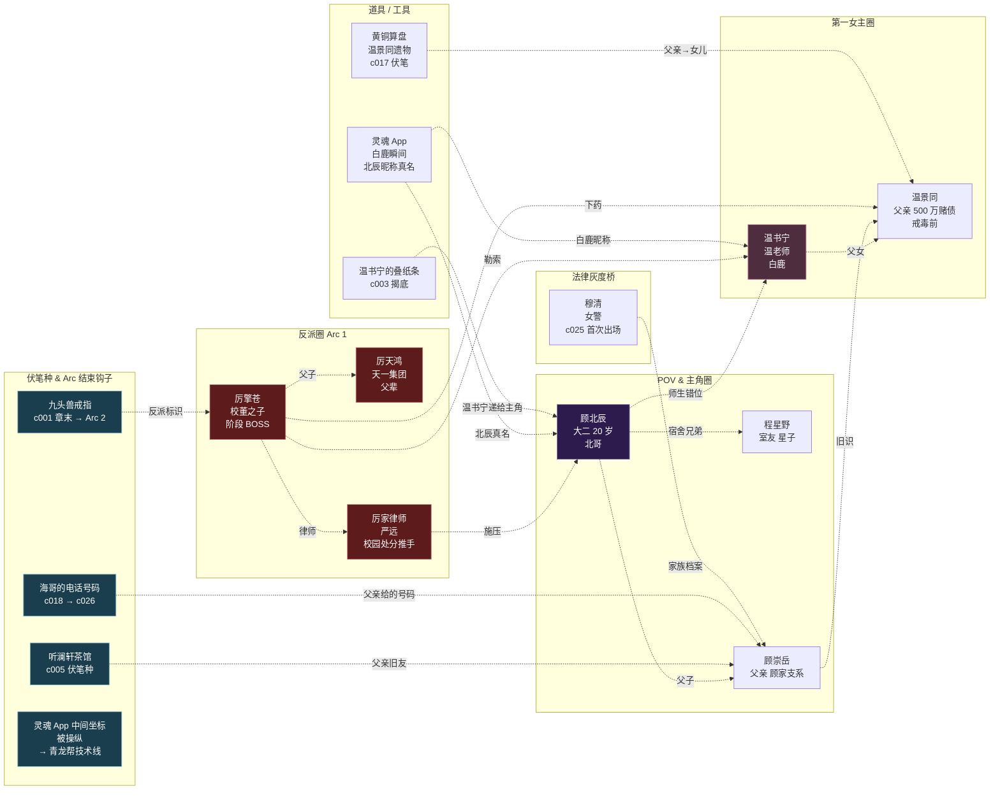

# Arc 1 《女神与仙人跳》剧情图谱

- **章节区间**：c001-c030（30 章 / 约 10-12 短剧集）
- **核心冲突**：匿名约见 → 识破仙人跳 → 反杀厉擎苍 → 校园处分 → 决定走街头路
- **核心对手**：厉擎苍（S1 阶段 BOSS）
- **核心新角色**：温书宁（第一女主）/ 程星野（室友兄弟）/ 厉擎苍（阶段反派）/ 温景同（麦高芬）
- **Arc 结局钩子**：主角被勒令退学 + 厉家律师登门 + 父亲顾崇岳接到 500 万代偿请求
- **本 arc 公开打脸预算**：7 次（身份错位 3 / 后台空降 1 / 技术碾压 2 / 伤势反转 1）
- **本 arc 后宫张力**：温书宁独家戏份 ≥ 8；程星野 / 穆清首次见面（穆清在 c025 以报警后处理场出现）
- **画面感代偿要点**：仙人跳 / 性威胁 / 床戏（关门镜头六法 №3 "第二天法"）/ 反杀（道具落地声）

---

## 一、剧情主流程图（Mermaid）

```mermaid
flowchart TD
    Start([Arc 1 开场<br/>c001]) --> A1[c001 白鹿的瞬间<br/>刷灵魂 App 星球广场<br/>接光 → 同轨 → 灵魂约见]
    A1 --> A2{"c002 中间坐标操纵<br/>揭底<br/>反派后台伏笔"}
    A2 --> A3[c003 识破仙人跳<br/>温景同 500 万赌债揭<br/>温书宁递纸条]
    A3 --> A4[c004 反杀厉擎苍<br/>红酒瓶道具 / 画面感收敛]
    A4 --> A5[c005 送温书宁去听澜轩<br/>听澜茶馆伏笔种]

    A5 --> B1[c006-c008<br/>校园风波第一波<br/>班级群截图 / 处分预警]
    B1 --> B2{"c009 厉家律师登门<br/>校董背景展示"}
    B2 --> B3[c010 顾北辰拒绝退学<br/>我爸给我取名北辰]
    B3 --> B4[c011 程星野兄弟表态<br/>星子愿陪北哥到底]

    B4 --> C1[c012-c014<br/>温书宁家访<br/>温景同戒毒前的侧写]
    C1 --> C2{"c015 温景同病倒<br/>关门镜头<br/>'手抖着翻书'"}
    C2 --> C3[c016 温书宁哭<br/>温景同叫出'崇岳'的名字<br/>父辈伏笔种]
    C3 --> C4[c017 顾北辰回家问父亲<br/>顾崇岳"我去年买了个表"]
    C4 --> C5[c018 顾崇岳沉默<br/>给了儿子一个电话号码<br/>海哥的号码]

    C5 --> D1[c019-c021<br/>校园处分到<br/>辅导员劝退]
    D1 --> D2[c022 顾北辰决定扛<br/>第一次公开打脸辅导员<br/>'我爸是校董的学长']
    D2 --> D3{"c023 厉擎苍私下报复<br/>宿舍搜捕"}
    D3 --> D4[c024 顾北辰逃出<br/>打海哥电话]
    D4 --> D5[c025 穆清出场<br/>以女警身份处理宿舍破坏案<br/>'我见过你爸的档案']

    D5 --> E1[c026-c028<br/>海哥约柳巷烧烤<br/>第一次见引路人]
    E1 --> E2[c029 温书宁第二次被威胁<br/>温景同被二次下药<br/>收敛：事后反常侧写]
    E2 --> F[c030 Arc 结局<br/>勒令退学通知书到<br/>厉家律师递来 500 万代偿协议<br/>顾崇岳接到帝都电话<br/>❗ 挂钩 Arc 2]

    style Start fill:#2d1b4e,stroke:#8b7cb6,color:#fff
    style F fill:#5e2d4e,stroke:#c47c9f,color:#fff
    style A2 fill:#1b3e4e,stroke:#7cb6c4,color:#fff
    style B2 fill:#1b3e4e,stroke:#7cb6c4,color:#fff
    style C2 fill:#1b3e4e,stroke:#7cb6c4,color:#fff
    style D3 fill:#1b3e4e,stroke:#7cb6c4,color:#fff
```

---

## 二、关系图（人物 / 组织 / 道具 / 伏笔）



---

## 三、Arc 内爽点锚点节奏表（30 章）

| 章节段 | 爽点锚点类型 | 具体锚点 | 画面感代偿 |
|---|---|---|---|
| c001-c005 | 身份错位 × 2 + 技术碾压 × 1 | 认出美女老师 / 识破中间坐标 / 识破折叠刀仙人跳 | 后门五秒停顿 / 折叠刀挎包 |
| c006-c010 | 后台空降 × 1 + 身份错位 × 1 | 厉家律师登门 / 顾北辰"我爸是校董的学长" | 校园公告 / 班级群截图 |
| c011-c015 | 伤势反转 × 1 + 情感暗流 × 2 | 程星野挨揍为北哥挡 / 温书宁第一次哭 | 温景同"手抖着翻书" |
| c016-c020 | 后台空降 × 1 + 文化内行 × 1 | 顾崇岳给电话号码 / 顾北辰读古诗十九首回敬辅导员 | - |
| c021-c025 | 技术碾压 × 1 + 道义制高点 × 1 | 公开拒退学 / 穆清出场认档案 | 宿舍搜捕"门被撞响" |
| c026-c030 | 后台空降 × 1 + 伏笔收束 × 多 | 海哥出场 / 500 万代偿协议 / Arc 结局钩子 | 柳巷烧烤的烟与火 |

---

## 四、Arc 1 短剧改编预估（adapter-agent 使用）

- **集数估算**：10-12 集（1 集 90 秒 → 3 章 ≈ 1 集；30 章 ≈ 10 集，含片头尾）
- **拍摄锚点**：
  - 红屋咖啡厅（c001-c004）
  - 蓉城·城南大专校园 + 宿舍（c005-c025）
  - 听澜轩茶馆（c005、c017）
  - 温书宁公寓（c012-c015、c029）
  - 柳巷烧烤（c026-c030）
- **独家卖点**：
  - "刷灵魂 App 刷到温老师的瞬间" × 身份错位（短剧前 3 集的最大吸粉点）
  - "反杀厉擎苍" × 街头狠劲（第一场 pay-off）
  - "我爸是校董的学长" × 后台空降（第一次公开打脸）
- **可拍 / 不可拍清单**：
  - ✅ 可拍：街角快餐店侧窥 / 咖啡厅卡座 / 校园处分通知 / 柳巷烧烤
  - ❌ 不可拍：红酒瓶砸头的近景血浆（用"瓶子落地 + 对方跪下"外化）
  - ❌ 不可拍：温景同下药过程（用"手抖着翻书"侧写）

---

## 五、迁移说明

- 本 arc 已创建 `drafts/chapters/s1a-encounter-trap/` 目录
- `c001-白鹿的瞬间.md` 已迁入该目录
- 后续 c002-c030 新章节都写入该目录
- Arc 结束时追加该目录下 `README.md`（adapter-agent 短剧改编元数据）

---

## 延伸

- 父目录 `wiki/plot/短剧Arc分段骨架.md`
- 下 Arc → `wiki/plot/arcs/Arc2-城南立足-图谱.md`（Arc 1 完成后创建）
- 核心人物：`wiki/characters/顾北辰` / `wiki/characters/温书宁` / `wiki/characters/温景同` / `wiki/characters/厉擎苍` / `wiki/characters/程星野` / `wiki/characters/穆清`
- 收敛参考：`wiki/world/敏感红线预防清单·开写前.md` §4.1-§4.3
- 节奏参考：`wiki/world/爽点节奏保障方案.md`
