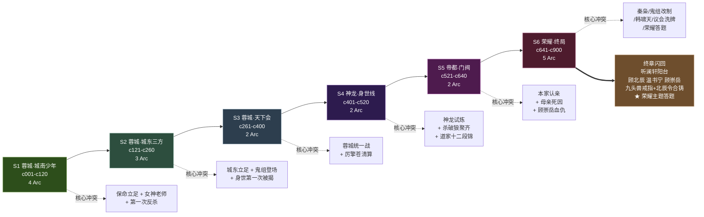
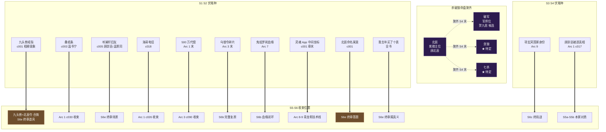
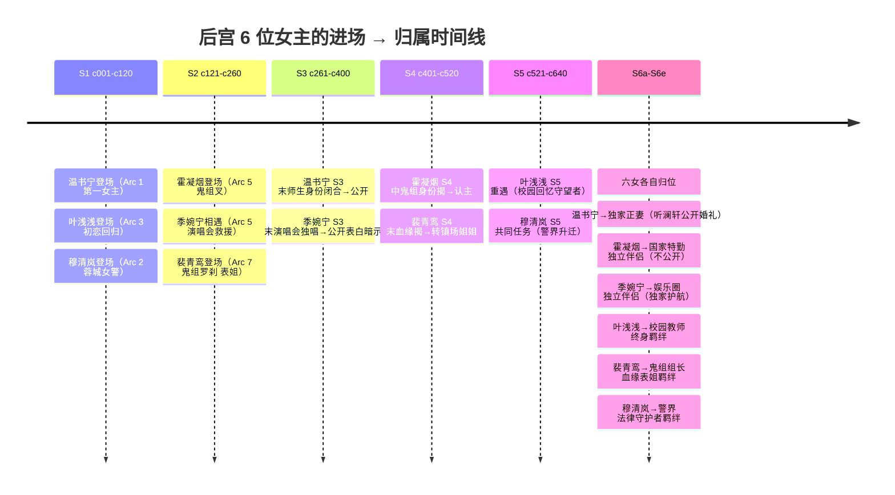

# 《我的荣耀》全书大纲总览·开写前最后一张图

> 本页是**改编前最后一张总览图**。所有已固化的决议、人物、组织、分段、伏笔、命盘、结尾方向在此一处可读完。
> 开写 c002 之前的最终 ACK 页。
>
> 其他详细页：
> - 单人物详情 → `wiki/characters/*.md`
> - 单组织详情 → `wiki/factions/*.md`
> - 分段骨架 → `wiki/plot/短剧Arc分段骨架.md`
> - Arc 1 剧情图谱 → `wiki/plot/arcs/Arc1-女神与仙人跳-图谱.md`
> - 结尾方向 → `wiki/plot/S5-S6结尾重构·方向简报.md`

---

## 一、全书元参数（固化）

| 参数 | 值 | 决议 |
|---|---|---|
| 主角 | 顾北辰（北哥 / 20 岁 / 大二） | DEC-001 |
| 文脉底盘 | 淮军 / 湘军 / 漕运 / 内务府 / 北洋 → 顾霍裴秦韩 五家 | DEC-001 |
| 组织骨架 | 天下会 / 鬼组 / 海迪 / 狼舞 / 白袍会 / 忠信帮 / 飞鸿帮 / 青龙帮 / 青花会 / 五家议会 / 天一集团 / 神龙基地 | DEC-002 / DEC-004 |
| 分段 | S1-S6 卷 → 18 Arc | DEC-003 / DEC-007 |
| 创作定调 | 都市逆袭 + 打怪升级 + 爽文 + 后宫（画面感代偿）| DEC-005 |
| 篇幅 | 880-900 章 / 300-320 万字 | DEC-006 / DEC-007 |
| 结尾方向 | 方向 C 双层结局 | DEC-007 |
| 女主改名 | 霍凝烟 / 季婉宁 / 穆清岚 | DEC-008 |
| 命盘主轴 | 北辰（紫微）+ 杀破狼（破军=贺九思 / 贪狼 / 七杀）聚齐在 S4 末；"众星拱北辰"落 S6 | DEC-003 |

---

## 二、人物组织故事拓扑图（Mermaid）

```mermaid
graph TB
    subgraph MAIN[主角圈]
        direction TB
        BC[顾北辰<br/>北哥 大二 20 岁<br/>命盘北辰 紫微主位]
        GCY[顾崇岳<br/>父亲 顾家被逐支系<br/>淮军铭字营 后裔]
        PYG[裴云归<br/>母亲 已故<br/>裴家出走支系]
        CXY[程星野<br/>星子 室友兄弟]
        HQS[贺九思<br/>半仙 军师<br/>杀破狼·破军候补]
        HSH[洪四海<br/>海哥 引路人]
    end

    subgraph HAREM[后宫 6 位女主]
        direction TB
        WSN[温书宁<br/>温老师 第一女主<br/>★独家正妻]
        HNY[霍凝烟<br/>鬼组叉 核心女主<br/>国家特勤 独立伴侣]
        JWN[季婉宁<br/>艺名洛神 歌坛明星<br/>娱乐圈 独立伴侣]
        YQQ[叶浅浅<br/>初恋 校园线<br/>终身羁绊]
        PQL[裴青鸾<br/>鬼组罗刹 表姐<br/>血缘羁绊]
        MQL[穆清岚<br/>蓉城女警<br/>法律守护者 羁绊]
    end

    subgraph FACTION_MAIN[主角阵营]
        direction TB
        TXH[天下会<br/>S3 创立 主角亲手]
        HD[海迪 狼舞<br/>城东据点]
        GZ[鬼组<br/>裴家关联清障队<br/>S6 改制]
        SL[神龙基地<br/>国家选拔机构<br/>S4 主舞台]
    end

    subgraph FIVE[五家议会 文脉顶层]
        direction TB
        GJ[顾家<br/>淮军铭字营 洋务轮船<br/>中东能源 港口]
        HJ[霍家<br/>内务府皇商 御医<br/>顶级私立医院]
        PJ[裴家<br/>江南漕运 晋商票号<br/>金融 文化 拍卖]
        QJ[秦家<br/>北洋奉系 军统<br/>安保 情报 跨境雇佣兵<br/>★ 大反派]
        HAJ[韩家<br/>湘军 曾国藩<br/>医药生物 ★ 大反派]
    end

    subgraph VILLAIN[反派阵营]
        direction TB
        LQC[厉擎苍<br/>S1-S3 阶段 BOSS<br/>校董之子]
        LTH[厉天鸿<br/>天一集团董事长<br/>S2-S3 幕后]
        QX[秦枭<br/>S5-S6 大反派<br/>秦家外脉少主]
        HXT[韩啸天<br/>S6 终局<br/>黑道第一人]
        QLB[青龙帮<br/>跨城灰色打手<br/>厉家外围]
        TY[天一集团<br/>资本抓手]
    end

    subgraph SIDE[辅助势力]
        direction TB
        BPH[白袍会<br/>老派袍哥 蓉城城北]
        ZXB[忠信帮<br/>宁云疏遗业 并入天下会]
        FHB[飞鸿帮<br/>贺飞鸿 S3 并入]
        QHH[青花会<br/>韩墨渊 跨城学术]
    end

    %% 血缘
    GCY -.父子.-> BC
    PYG -.母子.-> BC
    PYG -.兄妹.-> PWJ[裴无咎<br/>舅舅 鬼组组长]
    PWJ -.父女.-> PQL

    %% 恋爱 / 情感
    BC ==正妻==> WSN
    BC ==独立伴侣==> HNY
    BC ==独立伴侣==> JWN
    BC -.羁绊.-> YQQ
    BC -.血缘羁绊.-> PQL
    BC -.羁绊.-> MQL

    %% 兄弟
    BC === CXY
    BC === HQS
    BC === HSH

    %% 阵营归属
    BC --> TXH
    HSH --> HD
    HD --> TXH
    PWJ --> GZ
    PQL --> GZ
    HNY --> GZ
    BC --> SL

    %% 家族归属
    GCY --> GJ
    BC -.本家待认.-> GJ
    HNY --> HJ
    PYG --> PJ
    PWJ --> PJ
    PQL --> PJ
    QX --> QJ
    HXT --> HAJ

    %% 五家议会
    GJ --> FJYH[五家议会<br/>春分 秋分 正会<br/>★ 全书终局舞台]
    HJ --> FJYH
    PJ --> FJYH
    QJ --> FJYH
    HAJ --> FJYH

    %% 反派链
    LQC -.父子.-> LTH
    LTH --> TY
    LTH -.金主.-> QLB
    QX -.幕后.-> QLB
    QX -.外脉.-> QJ
    HXT -.族长.-> HAJ

    %% 辅助势力并入
    ZXB -.S3 并入.-> TXH
    FHB -.S3 并入.-> TXH
    BPH -.调停.-> TXH
    QHH -.合法化通路.-> TXH

    %% 主角对抗线
    BC -.S1-S3 阶段对抗.-> LQC
    BC -.S2-S3 对抗.-> LTH
    BC -.S5-S6 对抗.-> QX
    BC -.S6 终局.-> HXT

    style BC fill:#2d1b4e,stroke:#8b7cb6,color:#fff
    style WSN fill:#4e2d3e,stroke:#c47c9f,color:#fff
    style HNY fill:#4e2d3e,stroke:#c47c9f,color:#fff
    style JWN fill:#4e2d3e,stroke:#c47c9f,color:#fff
    style YQQ fill:#3e2d4e,stroke:#9f7cc4,color:#fff
    style PQL fill:#3e2d4e,stroke:#9f7cc4,color:#fff
    style MQL fill:#3e2d4e,stroke:#9f7cc4,color:#fff
    style LQC fill:#5e1b1b,stroke:#c47c7c,color:#fff
    style LTH fill:#5e1b1b,stroke:#c47c7c,color:#fff
    style QX fill:#5e1b1b,stroke:#c47c7c,color:#fff
    style HXT fill:#5e1b1b,stroke:#c47c7c,color:#fff
    style QLB fill:#5e1b1b,stroke:#c47c7c,color:#fff
    style TY fill:#5e1b1b,stroke:#c47c7c,color:#fff
    style FJYH fill:#6e4e2d,stroke:#c4a07c,color:#fff
    style SL fill:#1b4e3e,stroke:#7cc49f,color:#fff
```



---

## 三、全书故事发展线（Mermaid 时间轴）



---

## 四、18 Arc 单元细节（短剧改编友好）

| # | Arc | 卷 | 章节 | 核心对手 | 核心新角色 | 结局钩子 |
|---|---|---|---|---|---|---|
| 1 | 女神与仙人跳 | S1 | c001-c030 | 厉擎苍 | 温书宁 / 程星野 / 温景同 | 退学 + 500 万代偿 + 帝都电话 |
| 2 | 城南立足 | S1 | c031-c060 | 厉家外围 + 飞鸿帮 | 洪四海 / 贺飞鸿 / 穆清岚 | 温书宁被绑皇城赌场 |
| 3 | 赌场救美 | S1 | c061-c090 | 皇城赌场金主（厉天鸿） | 温景同 / 顾崇岳出场 / 叶浅浅回归 | 500 万被代偿 + 乌银令碎片 |
| 4 | 乌银令的回音 | S1 | c091-c120 | 厉天鸿旁系 + 鬼组杀手 | 裴青鸾远望 / 裴无咎信件 | 鬼组杀手现 + 血脉被试探 |
| 5 | 城东海迪 | S2 | c121-c160 | 肥猫 | 霍凝烟（叉）/ 宁云疏 / 季婉宁见面 | 肥猫反杀 + 霍凝烟登场 |
| 6 | 白袍会吃讲茶 | S2 | c161-c200 | 老派反对派 | 卜立国 / 裴无咎 / 贺九思 | 血缘揭 + 血仇浮出 |
| 7 | 鬼组罗刹 | S2 | c201-c260 | 鬼组清算派 | 裴青鸾登场 | 鬼组分裂 + 神龙征召函 |
| 8 | 天下会立 | S3 | c261-c320 | 厉家军师团 | 青龙帮入蓉 / 青花会 | 温书宁被绑 + 天一施压 |
| 9 | 蓉城统一战 | S3 | c321-c400 | 厉天鸿 + 青龙帮 | 韩墨渊 | 项玄冥上门 + 征召神龙 |
| 10 | 神龙试炼 | S4 | c401-c460 | 挑战赛军师团 | 项玄冥 / 同期对手 | 道家十二段锦 + 破军位现 |
| 11 | 杀破狼聚齐 | S4 | c461-c520 | 外围 + 秦家斥候 | 杀破狼三星候选 | 五家议会邀函 + 父软禁 |
| 12 | 入帝都 | S5 | c521-c580 | 顾家本家 + 韩家中立 | 韩啸天 / 本家族老 | 议会首败 + 裴云归死因重启 |
| 13 | 议会第一战 | S5 | c581-c640 | 本家 + 秦家明面 | 秦枭登场 | 秦枭宣战 + 终局暗局形成 |
| 14 | 秦枭之局 | S6 | c641-c700 | 秦枭 + 跨境雇佣兵 | 跨境雇佣兵首领 | 秦枭末被清算 |
| 15 | **鬼组改制 + 血缘闭环** | S6 | c701-c750 | 鬼组保守派 | 鬼组改制派 | 乌银令完整复原 |
| 16 | 韩啸天终局 | S6 | c751-c800 | 韩啸天 | 终局见证者 | 韩啸天让位 |
| 17 | **五家议会洗牌** | S6 | c801-c850 | 议会保守派 | 国家监察代表 | 秋分正会落槌 + 北辰之位就位 |
| 18 | 荣耀（答题）| S6 | c851-c900 | - | - | 听澜轩阳台闪回 + 全书完 |

---

## 五、命盘杀破狼与伏笔收束（Mermaid）



---

## 六、六位女主弧线与归属（Mermaid）



---

## 七、关键待确认事项（开写前最后一轮 ACK）

### 已 ACK（固化）

| 项 | 决议 |
|---|---|
| 主角与五家族命名 | DEC-001 |
| 组织名保留 + 真实渊源 | DEC-002 |
| S1-S6 分卷骨架 | DEC-003 |
| 青帮 → 青龙帮 | DEC-004 |
| 创作定调四联 | DEC-005 |
| 原著烂尾授权 | DEC-006 |
| 结尾方向 C 双层结局 | DEC-007 |
| 女性角色改名 | DEC-008 |

### 开写前可选 ACK（非阻塞）

1. **贪狼 / 七杀 两位候选人物**（S4 命盘聚齐时需定）
   - 贪狼候选：霍凝烟 / 洪四海 / 新角色
   - 七杀候选：程星野 / 新角色
   - 可以**延后到 Arc 10 开写前再定**
2. **跨境雇佣兵组织命名**（Arc 14 核心对手）
   - 候选：钩吻会 / 玄风佣兵团 / 落日旅
   - 可以**延后到 Arc 14 开写前再定**
3. **国家监察机构命名**（Arc 17 新引入角色所属）
   - 候选：风纪司 / 瞭望处 / 乾坤局
   - 可以**延后到 Arc 17 开写前再定**

---

## 八、开写路径建议

```
现在 → c002（接光纸条揭底 + 厉擎苍出场）
     → c003-c030 完成 Arc 1 → Arc 1 短剧 README
     → Arc 2-4 图谱 + 开写 → S1 完
     → S2-S6 Arc 推进（editor-agent 按卷 arc 推进）
     → S6e 终章答题 → 全书完
```

**今天用户的 ACK 决定**：
- □ 本图谱已 OK → 开 c002
- □ 需要再补什么？
- □ 需要修改哪个决策？

---

## 延伸

- 单人物详情 → `wiki/characters/*.md`
- 单组织详情 → `wiki/factions/*.md`
- 分段骨架详情 → `wiki/plot/短剧Arc分段骨架.md`
- Arc 1 剧情图谱 → `wiki/plot/arcs/Arc1-女神与仙人跳-图谱.md`
- 结尾方向 → `wiki/plot/S5-S6结尾重构·方向简报.md`
- 爽点节奏方案 → `wiki/world/爽点节奏保障方案.md`
- 敏感红线清单 → `wiki/world/敏感红线预防清单·开写前.md`
- 人物称谓防漏改 → `wiki/continuity/人物称谓全索引·防漏改.md`
- 命名映射 → `wiki/continuity/continuity-naming-map.md`