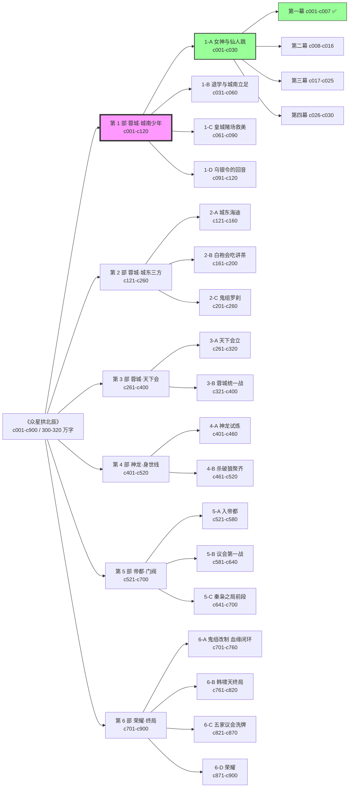

# 《众星拱北辰》分层递归大纲·6 部骨架

> **决议来源**:用户 2026-10-11:"18 部太多了,我还是倾向于 5、6 部的划分,按主角成长 + 新城市 + 新地位。如果过程中仍然觉得一下子很多,那就在每一部里继续根据剧情、高潮点拆分,类似于层级递归的分层,但是要做好类似思维导读的拓扑图梳理"
>
> **分层逻辑**:
> - **第 1 层(部,Part)**:主角所在地 + 身份跃迁(6 部)
> - **第 2 层(卷内 Arc)**:每部按高潮/爽点闭环拆 2-5 个 Arc
> - **第 3 层(幕,Act)**:每 Arc 按 3-4 幕(第一幕开场建置 / 第二幕冲突升级 / 第三幕反转 / 第四幕收束+Arc 钩)
> - **第 4 层(章,Chapter)**:每幕 5-10 章,每章 1 scene 粒度钩+1 承接+1 爽点锚
>
> **本页是唯一分段权威**。写作/短剧改编/lint/图谱 全部以本页为准。
> `wiki/plot/短剧Arc分段骨架.md` 已被本页覆盖(保留历史参考)。

---

## 一、第 1 层:全书 6 部骨架(主结构)

| 部 | 卷名 | 主角身份 | 主要城市 | 章节区间 | 核心冲突 | 爽感主旋律 |
|---|---|---|---|---|---|---|
| **第 1 部** | **蓉城·城南少年** | 网吧少年 / 大专大二生 | 蓉城·城南 | c001-c120 | 识破仙人跳 → 保温家 → 退学危机 → 女神老师 → 鬼组杀手试探 | 身份错位 / 文化内行 / 公开打脸 / 情感暧昧 |
| **第 2 部** | **蓉城·城东三方** | 海迪二把手 / 江湖初来者 | 蓉城·城东→城北 | c121-c260 | 入海迪 → 挑战肥猫 → 白袍会吃讲茶 → 鬼组罗刹揭血缘 | 街头反杀 / 江湖规矩 / 兄弟聚齐 / 身世第一揭 |
| **第 3 部** | **蓉城·天下会** | 蓉城霸主 / 组织创始人 | 蓉城全域 | c261-c400 | 天下会立 → 厉家反扑 → 蓉城统一战 → 项玄冥征召 | 组织化升级 / 大型团战 / 阶段大 BOSS 清算 |
| **第 4 部** | **神龙·身世线** | 神龙基地积分王 / 国家特勤 | 青城山 / 神龙基地 | c401-c520 | 挑战赛 → 十重天宫 → 道家十二段锦 → 杀破狼聚齐 → 五家邀函 | 境界突破 / 命盘聚齐 / 国家背景 / 身世第二揭 |
| **第 5 部** | **帝都·门阀** | 五家议会候任首席 / 本家北辰 | 帝都 | c521-c700 | 入帝都 → 本家不认 → 议会第一战 → 文化牌破韩家 → 秦枭宣战 | 门阀权谋 / 身份认亲 / 跨家博弈 / 本家对质 |
| **第 6 部** | **荣耀·终局** | 五家议会首席 / 北辰之位 | 帝都 ↔ 蓉城(双城闭环) | c701-c900 | 秦枭之局 → 鬼组改制 → 韩啸天终局 → 议会洗牌 → 荣耀答题 | 格局决战 / 血缘闭环 / 制度落地 / 主题答题 |

全书预估 **900 章 / 300-320 万字**。

---

## 二、第 2 层:每部内 Arc 拆分(高潮闭环)

### 第 1 部 蓉城·城南少年(c001-c120)

| Arc | Arc 名 | 章节 | Arc 高潮 | Arc 结尾钩 |
|---|---|---|---|---|
| 1-A | 女神与仙人跳 | c001-c030 | 顾崇信老大房登听澜轩阳台 + 烧担保单仪式 | 老三房只剩父子二人 + 顾崇信走后留一句"**本家正堂见**" |
| 1-B | 退学危机与城南立足 | c031-c060 | 柳巷找海哥 + 入海迪 + 第一次夜场战 | 温书宁被绑进皇城赌场 |
| 1-C | 皇城赌场救美 | c061-c090 | 500 万代偿暗线揭底 + 皇城赌场劫美战 | 代偿人"九头"标记 + 顾崇岳身份首次外泄 |
| 1-D | 乌银令的回音 | c091-c120 | 母亲裴云归线索 + 鬼组杀手第一次试探 | 鬼组霍凝烟首次远望 + 项玄冥征召函(S1→S2 过渡) |

### 第 2 部 蓉城·城东三方(c121-c260)

| Arc | Arc 名 | 章节 | Arc 高潮 | Arc 结尾钩 |
|---|---|---|---|---|
| 2-A | 城东海迪·入局 | c121-c160 | 肥猫被反杀 + 掌狼舞 | 鬼组霍凝烟首次正式接触 |
| 2-B | 白袍会吃讲茶 | c161-c200 | 卜立国出面调停 + 裴无咎(舅舅)揭血缘 | 顾北辰知道自己是裴家外孙 + 父亲血仇浮出 |
| 2-C | 鬼组罗刹 | c201-c260 | 裴青鸾(表姐罗刹)身份揭开 + 兄妹相认 | 鬼组内部分裂 + 项玄冥征召函送达 |

### 第 3 部 蓉城·天下会(c261-c400)

| Arc | Arc 名 | 章节 | Arc 高潮 | Arc 结尾钩 |
|---|---|---|---|---|
| 3-A | 天下会立 | c261-c320 | 蓉城三方并立 + 顾北辰创天下会 + 兄弟分堂口 | 温书宁被绑作要挟 + 天一集团全面施压 |
| 3-B | 蓉城统一战 | c321-c400 | 厉擎苍被清算 + 厉天鸿退场 + 青龙帮退蓉 | 项玄冥上门征召 + S4 开场 |

### 第 4 部 神龙·身世线(c401-c520)

| Arc | Arc 名 | 章节 | Arc 高潮 | Arc 结尾钩 |
|---|---|---|---|---|
| 4-A | 神龙试炼 | c401-c460 | 十重天宫冲层 + 道家十二段锦大成 | 杀破狼"破军"首次浮现 |
| 4-B | 杀破狼聚齐 | c461-c520 | 贺九思入破军位 + 命盘杀破狼聚齐 | 五家议会秋分邀函 + 父亲在京畿被软禁 |

### 第 5 部 帝都·门阀(c521-c700)

| Arc | Arc 名 | 章节 | Arc 高潮 | Arc 结尾钩 |
|---|---|---|---|---|
| 5-A | 入帝都 | c521-c580 | 本家顾氏不认 + 第一次入会失败 | 母亲裴云归死因重启 |
| 5-B | 议会第一战 | c581-c640 | 文化牌破韩家 + 血仇清算顾家本家 | 秦枭明面宣战 |
| 5-C | 秦枭之局(前段) | c641-c700 | 秦枭布局 + 穷奇旅跨境雇佣兵 + 核心兄弟一人重伤 | 秦枭 S5 末段被清算 + 韩家分裂派露头 |

### 第 6 部 荣耀·终局(c701-c900)

| Arc | Arc 名 | 章节 | Arc 高潮 | Arc 结尾钩 |
|---|---|---|---|---|
| 6-A | 鬼组改制·血缘闭环 | c701-c760 | 裴青鸾任新组长 + 母亲裴云归死因彻底揭开 | 裴云归遗物"乌银令"完整复原 |
| 6-B | 韩啸天终局 | c761-c820 | 议会终局战 + 韩啸天亲自出手 + 道家十二段锦大成 | 韩啸天让位 + 议会席位重排 |
| 6-C | 五家议会洗牌 | c821-c870 | 议会制度化 + 玄鉴台透明化 | 议会秋分正会落槌 + 北辰之位就位 |
| 6-D | 荣耀 | c871-c900 | 命盘闭环 + 身世闭环 + 荣耀主题答题 | 全书完 |

**说明**:原 18 Arc 结构里 S6 的 5 个 Arc 已经合并为 4 个(**秦枭之局**从 S6 挪到 S5-C 做收束,保证"**旧敌清算全部收在 S5**,S6 只剩'**本家血缘 + 制度 + 荣耀**'的大主题答题"),这样每部的"**部内高潮**"更干净。

---

## 三、第 3 层:每 Arc 分幕(3-4 幕结构)

**通用模板**(所有 Arc 共享):

| 幕 | 功能 | 占比 | 必有节奏 |
|---|---|---|---|
| **第一幕** | 开场建置 | 20% | Arc 开场钩 + 承接前 Arc 末钩 + 新角色 / 新资源入场 |
| **第二幕** | 冲突升级 | 40% | 2-3 次升压 + 1 次 pivot(主角从被动到主动)|
| **第三幕** | 反转 + 高潮 | 25% | 1 次公开打脸 / 1 次身份揭底 / 1 次关系升级 |
| **第四幕** | 收束 + 下 Arc 钩 | 15% | 本 Arc 爽感兑现 + 下 Arc 外部冲突触发器 |

**举例:1-A 女神与仙人跳(c001-c030)分幕**:

| 幕 | 章节 | 功能 | 已完成度 |
|---|---|---|---|
| 第一幕 | c001-c007 | 开场建置:灵魂 App 接光 → 识破仙人跳 → 认温书宁 → 父辈相识 → 顾崇信老大房浮出 → 温景同急诊昏迷 | ✅ 7 章正文 + 禁词 0 命中 |
| 第二幕 | c008-c016 | 冲突升级:医院对峙 → 严振声倒戈 → 温景同叫出"崇岳" → 听澜轩旧账簿第一次打开 → 顾崇信上阳台 | ⬜ 待写 scene outline |
| 第三幕 | c017-c025 | 反转高潮:烧担保单仪式 + 顾北辰公开"认账" → 老大房退场 → 温书宁第一次来家 → 父亲揭顾家本家 | ⬜ 待写 scene outline |
| 第四幕 | c026-c030 | 收束 + 下 Arc 钩:乌银手链"归"字揭 → 鬼组杀手试探 → 500 万代偿人"九头"浮出 → **退学通知 + 500 万代偿 + 1-B 开场钩** | ⬜ 待写 scene outline |

---

## 四、第 4 层:每章 scene 粒度 + grill-me 六问

**本层由 author-agent 按幕推进时逐章补**。每章 frontmatter 必须包含:

```yaml
grill_me_check:
  motivation_now: 人物此刻为何行动(动机 / 外部触发器)
  resource_from: 资源 / 信息 / 道具 / 钱 从何而来(前文是否已埋)
  opponent_counter: 对手为何不采用更优解
  cost_of_win: 胜利付出什么代价
  info_how_known: 主角 / 读者如何得知本章关键信息
  state_continuity: 上章末钩 / 本章首钩的时空 / 因果连续
```

六问未全部回答,**不开写**。
质询不过关,登记为 `proposed` 或 `待确认决策`(写入 decisions/)。

---

## 五、思维导读拓扑图(Mermaid)

```
drafts/chapters/
├── 第1部-蓉城城南少年/
│   ├── 1-A-女神与仙人跳/
│   │   ├── 第一幕-相遇与反杀/              c001-c007 ✅
│   │   ├── 第二幕-父辈的二十八年旧账/       c008-c016 ⬜
│   │   ├── 第三幕-顾家本家揭底/             c017-c025 ⬜
│   │   └── 第四幕-九头兽的代偿/             c026-c030 ⬜
│   ├── 1-B-城南立足/                       c031-c060 ⬜
│   ├── 1-C-皇城赌场救美/                   c061-c090 ⬜
│   └── 1-D-乌银令的回音/                   c091-c120 ⬜
├── 第2部-蓉城城东三方/
│   ├── 2-A-城东海迪/                       c121-c160 ⬜
│   ├── 2-B-白袍会吃讲茶/                   c161-c200 ⬜
│   └── 2-C-鬼组罗刹/                       c201-c260 ⬜
├── 第3部-蓉城天下会/
│   ├── 3-A-天下会立/                       c261-c320 ⬜
│   └── 3-B-蓉城统一战/                     c321-c400 ⬜
├── 第4部-神龙身世线/
│   ├── 4-A-神龙试炼/                       c401-c460 ⬜
│   └── 4-B-杀破狼聚齐/                     c461-c520 ⬜
├── 第5部-帝都门阀/
│   ├── 5-A-入帝都/                         c521-c580 ⬜
│   ├── 5-B-议会第一战/                     c581-c640 ⬜
│   └── 5-C-秦枭之局/                       c641-c700 ⬜
└── 第6部-荣耀终局/
    ├── 6-A-鬼组改制/                       c701-c760 ⬜
    ├── 6-B-韩啸天终局/                     c761-c820 ⬜
    ├── 6-C-五家议会洗牌/                   c821-c870 ⬜
    └── 6-D-荣耀/                           c871-c900 ⬜
```

**层级规则**:
- 第 1 层:`第N部-卷名/`(中文,review 友好)
- 第 2 层:`N-X-Arc名/`(X=A/B/C/D)
- 第 3 层(仅当 Arc 已拆分到幕时):`第N幕-幕名/`
- 第 4 层(叶子):`cNNN-中文标题.md`

---

## 六、Mermaid 拓扑图



**图例**:
- 🟣 粉底 = 当前所在部
- 🟢 绿底 = 当前所在 Arc / 幕
- ⬜ 白底 = 待写

---

## 六、主角成长 vs 身份跃迁 vs 爽感主旋律 对照表

| 部 | 开始身份 | 结束身份 | 核心能力增量 | 情感 / 后宫轴 |
|---|---|---|---|---|
| P1 | 网吧少年 | 退学 + 老三房嫡长 | 文化内行(《论语》《古诗十九首》) + 街头嗅觉 | 温书宁:陌生 → 师生错位 → 第一次交心 |
| P2 | 退学少年 | 海迪二把手 + 裴家外孙 | 江湖规矩 / 吃讲茶 / 鬼组血缘 | 温书宁:公寓受伤场;穆清岚:正式接触;霍凝烟:远望首见 |
| P3 | 海迪二把手 | 天下会会长 | 组织管理 / 跨组织联盟 | 温书宁:定情;叶浅浅:回归;季婉宁:远望首见 |
| P4 | 蓉城霸主 | 神龙积分王 / 杀破狼 | 道家十二段锦 / 境界 / 国家背景 | 霍凝烟:认情;叶浅浅:公开相认;季婉宁:正式接触 |
| P5 | 神龙积分王 | 五家议会候任首席 | 门阀礼制 / 议会博弈 / 本家族老 | 季婉宁:定情;穆清岚:帝都重逢;裴青鸾:兄妹相认 |
| P6 | 议会候任 | 议会首席 / 北辰 | 制度设计 / 玄鉴台监察 / 文脉继承 | 六位女主各自归宿 + 终章听澜轩 |

---

## 七、"**众星拱北辰**"书名诗眼落位(全书首尾呼应)

| 诗眼 | 落位 | 章节 |
|---|---|---|
| "北辰"出典首次埋 | 顾北辰开场自报名字出处 | c001 ✅ 已埋 |
| "**众星**"显形 | 杀破狼三星聚齐 | 第 4 部 4-B |
| "**众星归位**"初现 | 五家议会洗牌起手 | 第 5 部 5-C |
| "**众星拱北辰**"落地 | 议会首席就位 + 玄鉴台监察 | 第 6 部 6-C |
| 《论语》原句**完整念出** | 终章听澜轩阳台 | 第 6 部 6-D |

---

## 八、分批改编节奏(本次新规约)

### 8.1 单元粒度

**最小改编单元 = 幕**(5-10 章)
**最小 commit 单元 = Arc**(20-50 章 / 1 个月左右)
**最小 review 单元 = 部**(全部 Arc 落地后)

### 8.2 每批改编流程

```
【开新幕前】
  → 1. 读本幕 scene outline + 前后 2 章承接
  → 2. 每章 grill-me 六问逐一答(frontmatter grill_me_check)
  → 3. 六问全部过关才开写

【写】
  → 4. 对照"章节连贯性与完整性守则" / "爽点节奏保障方案" / "敏感红线预防清单"
  → 5. 章末钩 + 承接检查

【写完】
  → 6. 禁词扫描(0 命中硬门禁)
  → 7. 落稿检查(frontmatter 所有必填项)
  → 8. 同步 drafts/manuscript/latest.md

【幕结束】
  → 9. 中断 → 向用户 review
  → 10. 用户确认后再推下一幕

【Arc 结束】
  → 11. 更新 wiki/log.md
  → 12. 更新 wiki/clues/clue-ledger.md 伏笔收束
  → 13. 更新 graph/story-graph.json
  → 14. commit + push
```

### 8.3 当前进度卡

```
【第 1 部】蓉城·城南少年 (c001-c120)
  └─ [1-A] 女神与仙人跳 (c001-c030)
       ├─ [第一幕] c001-c007 ✅ 已写(禁词 0 / grill-me 自查已补齐 c001-c007)
       ├─ [第二幕] c008-c016 ⬜ 下一步:补 scene outline + grill-me 六问
       ├─ [第三幕] c017-c025 ⬜
       └─ [第四幕] c026-c030 ⬜
```

---

## 延伸

- 原卷骨架(保留历史) → `wiki/plot/structure-plot.md`(已废,信息并入本页)
- 原 18 Arc 骨架(保留历史) → `wiki/plot/短剧Arc分段骨架.md`(已废,信息并入本页)
- 当前 Arc 1 scene outline(需要重写加 grill-me) → `wiki/plot/arcs/Arc1-scene-outline-c001-c030.md`
- 新建 → `wiki/plot/arcs/1-A-第二幕-scene-outline.md`(下一步)
- 写作铁律 → `wiki/world/章节连贯性与完整性守则.md`
- 爽点节奏 → `wiki/world/爽点节奏保障方案.md`
- 敏感红线 → `wiki/world/敏感红线预防清单·开写前.md`
- grill-me skill → `.trae/skills/review/grill-me/`
